# MovieDB attempt — frame by frame

Rebuilt from a 42:52 screen recording of a real 60-minute MovieDB debugging assessment. Every fact was read off the screen; the stills live in `docs/attempt-stills/`.

---

## MovieDB Recommendations — My Attempt, Frame by Frame
*Amazon OA · Debugging Projects · Screen recording · 24 Jun 2026 · 42:52 · Attempt post-mortem · 0 / 6 tests passed*

>
**What this is.** A reconstruction of my real 60-minute attempt at
MovieDB (Django + React) — Movie Recommendations,
rebuilt frame-by-frame from the screen recording (the recording has no audio, so everything below
comes off the screen). Every still is stamped with two clocks: VIDEO is the
position in the recording, and the grey stamp is the **time left on the assessment clock** at that
instant. Recording starts with 41:52 showing, so *remaining ≈ 42:02 − video time*.
That clock is the whole **Coding Challenge (100 minutes)**, not a per-question timer — the
completion screen at the end confirms it — so 41:52 is what was left after the earlier item(s),
not a fresh hour.

**Outcome: 0 of 6 tests passing when time expired.** Four one-line bugs were still in the
file. Read the walk-through, then the playbook at the bottom — that is the part worth memorising.

### 1 · The system

A Django REST backend with a React frontend. Movies, ratings and reviews are three separate Django
apps. Only **one function** is broken: `get_recommendations` in
`backend/apps/ratings/views.py` (line 166 in the original file).

```python
backend/
  apps/movies/{models,views,urls}.py
  apps/ratings/{models,views,urls}.py     ← the entire task lives here
  apps/reviews/{models,views,urls}.py
  moviedb_backend/urls.py                 ← mounts /api/movies, /api/ratings, /api/reviews
  test/test_app.py                        ← the grader (~430 lines)
  pytest.ini · manage.py · db.sqlite3
frontend/                                 ← React; read-only for this task
```

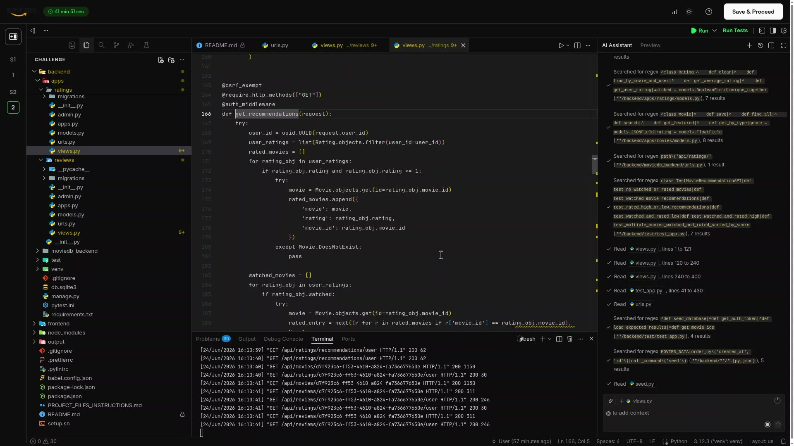

*00:10  41:52 left
    The workspace.  Project tree on the left, four tabs open, AI Assistant on the right,
  and the dev-server log in the terminal already showing live traffic to
   /api/ratings/recommendations/user . The exam clock is top-left.*

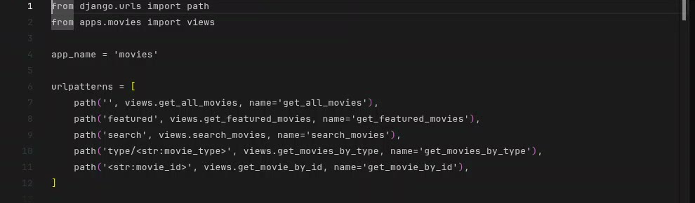

*00:30  41:32 left
    Routing.  Each app owns a  urls.py . Useful for confirming the exact path the
  test hits — but this file was never the problem.*

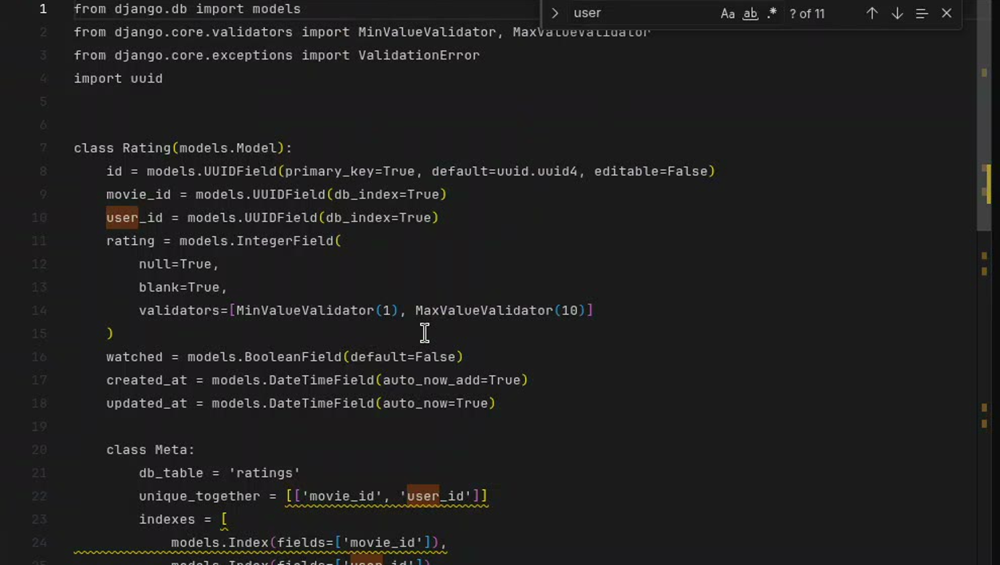

*05:30  36:32 left
    The  Rating  model.  One row per (user, movie):  rating  is a
  nullable 1–10 integer and  watched  is a boolean. So a single row can be
  rated-only, watched-only, or both — which is exactly what the five-case algorithm table below
  keys off.*

### 2 · The endpoints

| Endpoint | Purpose

| `GET /api/ratings/recommendations/user` | **the broken one** — personalized recommendations

| `POST /api/ratings/:movieId` | submit / update a rating (1–10)

| `GET /api/ratings/:movieId/user` | this user's rating + watched status

| `POST /api/ratings/:movieId/watched` | mark / unmark watched

All four require `Bearer` auth via the `@auth_middleware` decorator.

The recommendations endpoint has **three** response shapes, and getting the wrong one
is what most of the failures were:

```python
// has recommendations
{"message": "Found 10 personalized recommendations", "recommendations": [ ... ]}

// no activity at all
{"message": "Start exploring movies by rating them or marking them as watched...",
 "recommendations": []}

// has activity, but nothing scored
{"message": "No recommendations found. Try rating more movies...", "recommendations": []}
```

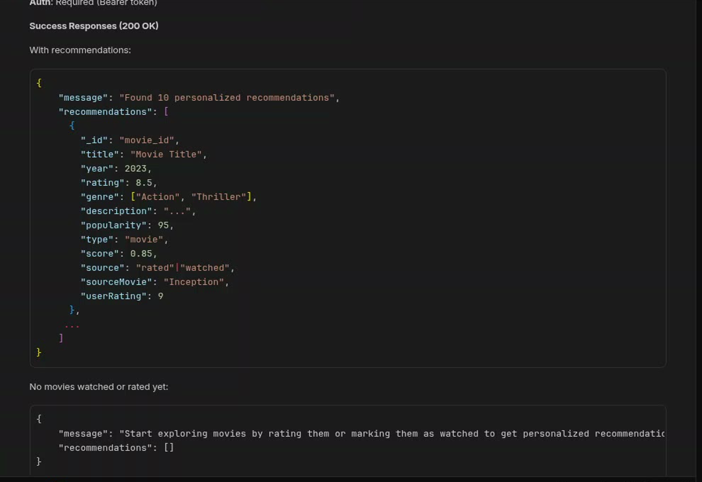

*02:00  40:02 left
    The spec's own example response.  Note the per-item fields:  score ,
   source  ( "rated"  |  "watched" ),  sourceMovie , and
   userRating . The tests assert on  source  and  sourceMovie
  directly.*

### 3 · The algorithm

| User action | Strategy | Multiplier

| Rated **high** (above 5) | similar genres | 1.2×

| Rated **low** (5 or below) | *different* genres | 1.0

| Watched only (no rating) | similar genres | 1.0

| Watched + rated high | similar genres | 1.2×

| Watched + rated low | *different* genres | 1.0

```python
totalScore = (genreScore × 0.7 + ratingScore × 0.3) × multiplier

genreScore  = (# genres shared with the source movie) / len(source.genre)
ratingScore = candidate.rating / 10
```

**Constraints** — every one of these is separately testable:

- only recommend movies with `rating >= 7.0`

- remove duplicates, sort by score **descending**, return **top 10**

- same movie from two sources → keep the **higher** score

- a movie both rated and watched → the **rated** signal wins

- `userRating` appears **only** when `source == "rated"`

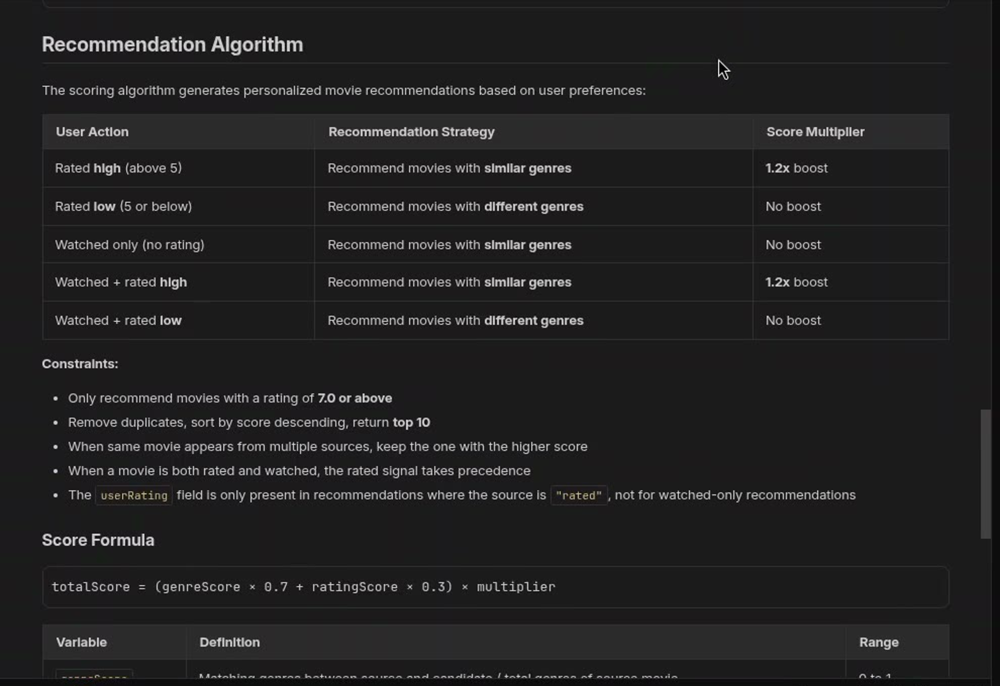

*06:10  35:52 left
    The whole specification on one screen  — table, constraints and score formula. I had
  this open at minute 6 and still had not run the tests.*

### 4 · The tests

`backend/test/test_app.py` · class `TestMovieRecommendationAPI` · run with
`npm run test` (pytest under the hood) · **6 tests**. Helpers:
`seed_database()`, `get_movie_ids()`, `get_auth_token(self.client)`.
Each test seeds the DB, drives the *real* API with `self.client.post(...)` to set up
ratings and watched flags, then GETs recommendations and asserts on
`data['message']` and `data['recommendations']`.

| # | Test | Asserts

| 1 | `test_no_watched_or_rated_movies` | `'Start exploring movies'` in message

| 2 | `test_watched_movie_recommendations` | 200 + list; checks `source` / `sourceMovie`

| 3 | `test_rated_high_or_low_recommendations` | rates 9/10 → `'Found'`, 10 recs, `userRating`

| 4 | `test_watched_and_rated_low` | rates 5/10 + watched → `'No recommendations found'`, `len == 0`

| 5 | `test_watched_and_rated_high` | `'Found'` in message

| 6 | `test_multiple_movies_watched_and_rated_sorted_by_score` | results sorted by score descending

>
**The tests are far stricter than the prose spec suggests.** Tests 2–6 do not just check
the message — each one loads a **golden JSON fixture**
(`expected-high-rating.json`, `expected-low-rating.json`,
`expected-watched-low-rating.json`) and walks the returned list *in order*:

```
expected_results = load_expected_results('expected-high-rating.json')
for i, rec in enumerate(data['recommendations']):
    expected = expected_results[i]
    assert rec['title']  == expected['title']
    assert rec['year']   == expected['year']
    assert rec['rating'] == expected['rating']
    assert rec['genre']  == expected['genre']
    assert rec['description'] == expected['description']
    assert rec['popularity']  == expected['popularity']
    assert rec['type']   == expected['type']
    assert abs(rec['score'] - expected['score'])
**Read that output as a fingerprint.** Two messages are swapped in *both*
directions, and one response is missing a key entirely. That is not five separate problems — it is
**two inverted `if` conditions plus one missing dict entry**. Four lines. The
whole diagnosis was available at minute 18.

### 6 · The bugs

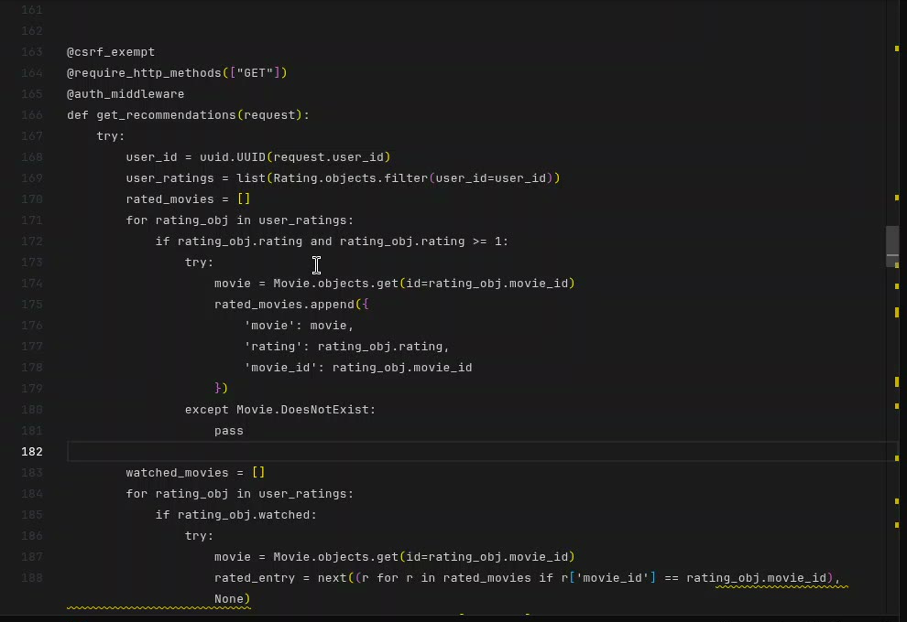

*05:50  36:12 left
    Phase 1 of the function  — build  rated_movies  from every rating
  ( >= 1 , i.e. high  and  low; low ratings drive the "different genres" path, so
  this is correct).*

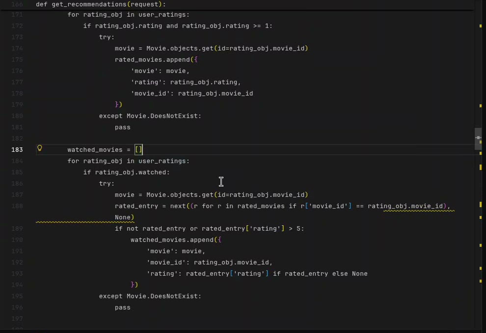

*07:10  34:52 left
    Phase 2  — build  watched_movies , attaching the matching rating if one
  exists. Directly below it sits the guard that became Bug 1.*

#### Bug 1 — the no-activity guard is inverted (line ~163)

```python
# ✗ fires only when the user HAS activity — exactly backwards
if len(rated_movies) != 0 and len(watched_movies) != 0:
    return ... "Start exploring movies..."

# ✓
if not rated_movies and not watched_movies:
    return ... "Start exploring movies..."
```

Breaks test 1 directly, and poisons test 4.

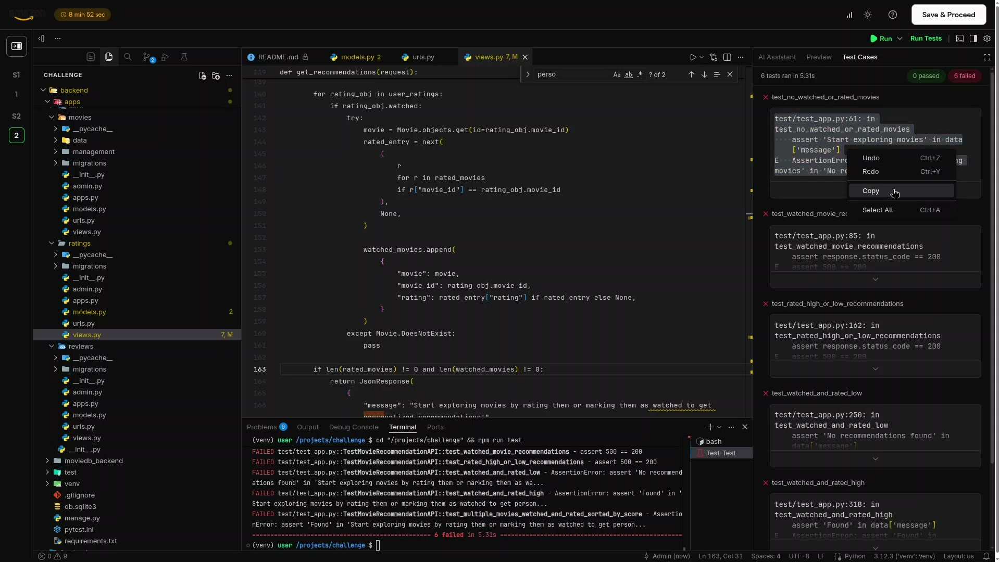

*33:10  8:52 left
    Bug 1 still live at minute 33 , highlighted on line 163. Over the session this line was
  edited five times and was  correct at 24:30 , then reverted, then made worse at 32:30, and
  only settled correct at 36:10. Editing without a test run between changes means never knowing
  which direction was right.*

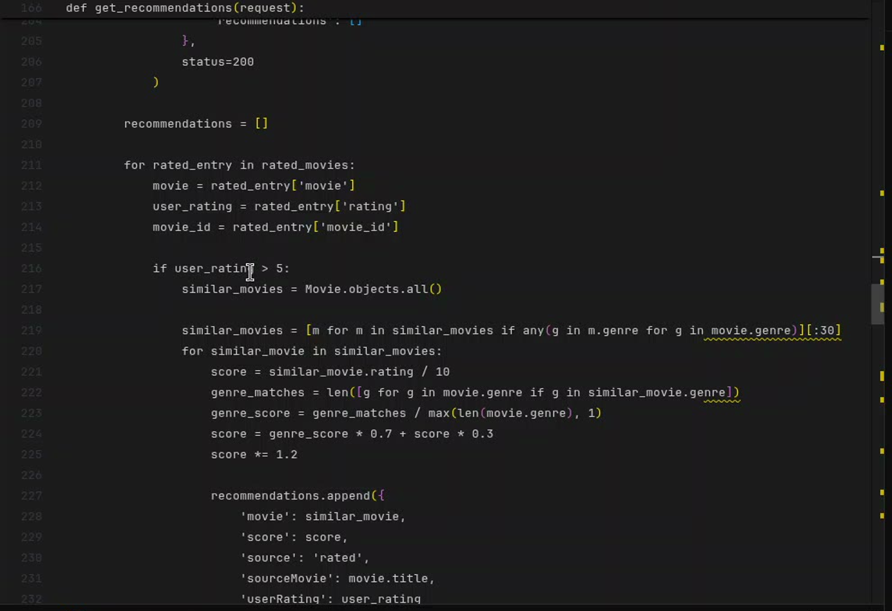

*17:40  24:22 left
    The scoring branch as it started.   Movie.objects.all()  with no
   rating >= 7.0  filter, no  .exclude(id=movie.id) , and no 1.2×
  multiplier. All three were genuine bugs — and all three I did fix.*

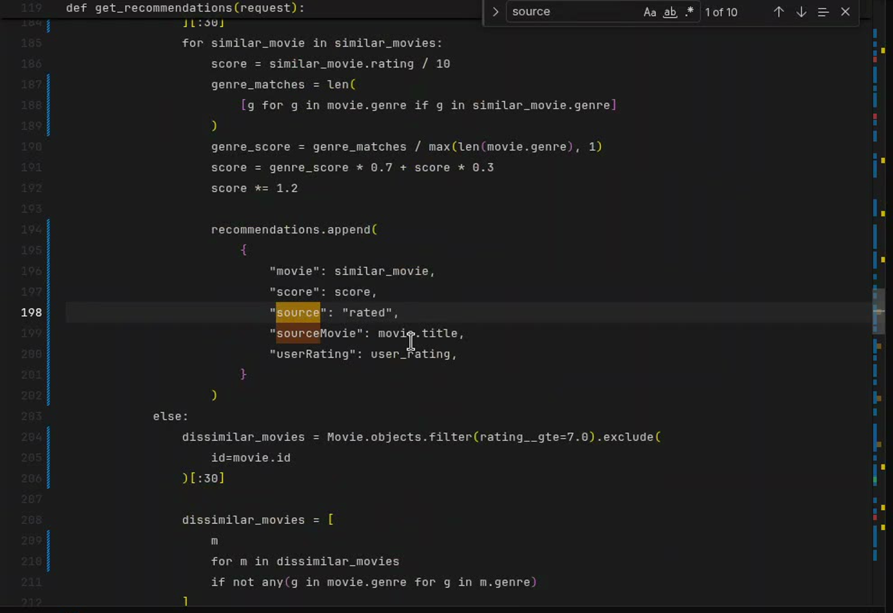

*25:10  16:52 left
    Fixed ✓  —  rating__gte=7.0 ,  .exclude(id=movie.id)  and
   score *= 1.2  now all present in the rated-high branch.*

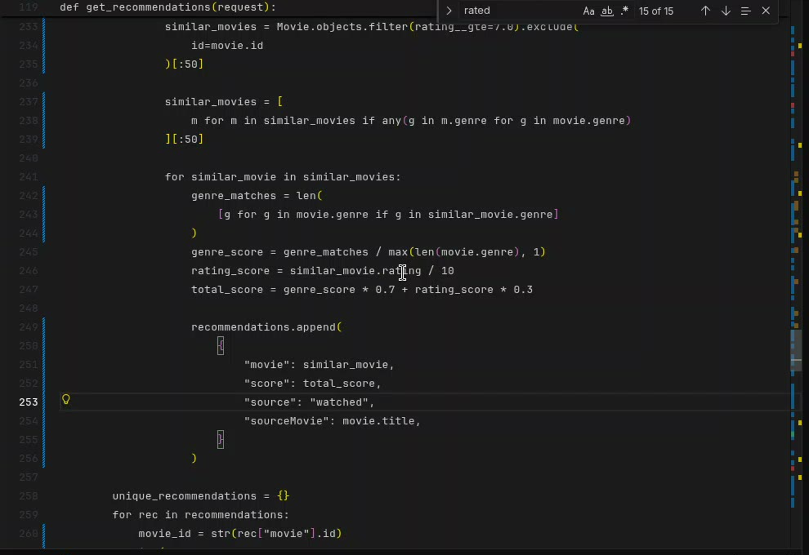

*26:30  15:32 left
    Fixed ✓  — the watched-only branch, correctly scoring with no multiplier and emitting
   "source": "watched"  with no  userRating  key.*

#### Bug 2 — sorting a list of dicts, and slicing before sorting (lines 267–268)

```python
# ✗ two bugs stacked on two lines
sorted_recommendations = list(unique_recommendations.values())[:10]   # slices BEFORE sorting
sorted_recommendations.sort(reverse=True)                             # TypeError on dicts

# ✓ sort by an explicit key, THEN take the top 10
sorted_recommendations = sorted(
    unique_recommendations.values(), key=lambda r: r["score"], reverse=True
)[:10]
```

`.sort()` on dicts raises
`TypeError: '<' not supported between instances of 'dict' and 'dict'`. The function's
bare `except Exception` swallows it and returns **500** — which is why test 2
saw `KeyError: 'recommendations'` and, later, `assert 500 == 200`.
**This one bug cost the exam.**

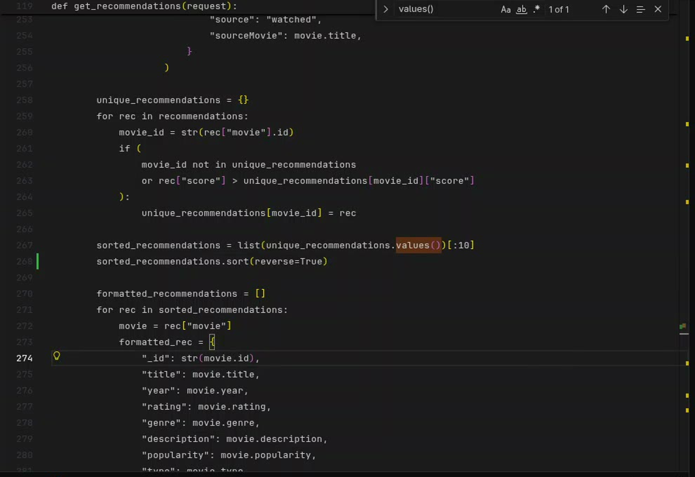

*29:30  12:32 left
    Bug 2 on screen, unnoticed.  The dedupe loop above it is correct — keep the higher
  score per movie id. The two lines under it are the whole failure.*

#### Bug 3 — the empty-result guard is inverted (line 290)

```python
if len(formatted_recommendations) != 0:      # ✗ says "none found" when there ARE results
    return ... "No recommendations found"

if len(formatted_recommendations) == 0:      # ✓
```

#### Bug 4 — the success response has no payload (line 296)

```python
# ✗ "recommendations" key is simply absent → KeyError in every test that reads it
return JsonResponse({
    "message": f"Found {len(formatted_recommendations)} personalized recommendations"
}, status=200)

# ✓
return JsonResponse({
    "message": f"Found {len(formatted_recommendations)} personalized recommendations",
    "recommendations": formatted_recommendations,
}, status=200)
```

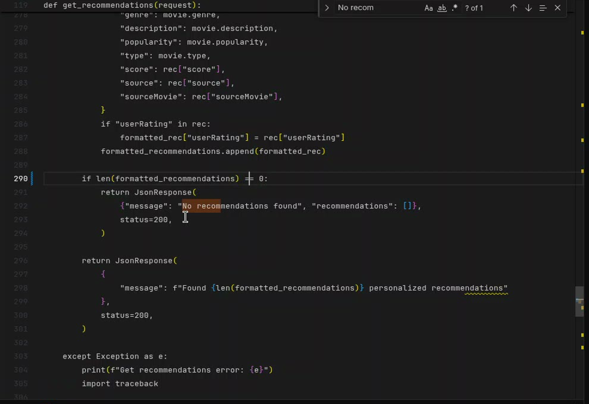

*30:20  11:42 left
    Bugs 3 and 4 in a single screenshot.  Line 290 is inverted; the return at line 296 sends
  a message and nothing else. I scrolled past this block and did not compare it against the spec's
  three response shapes.*

### 7 · How the failures evolved

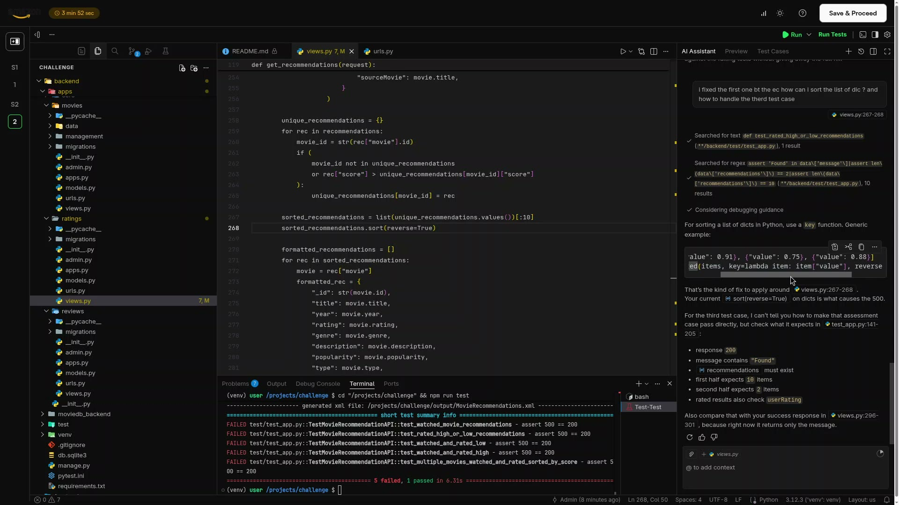

*38:10  3:52 left
    The assistant finally names Bug 2  — "sorting a list of dicts needs a key function… your
  current  .sort(reverse=True)  is what causes the 500". Correct, and 21 minutes after the
  first 500 appeared. I had been using it to explain the frontend instead of to read a
  traceback.*

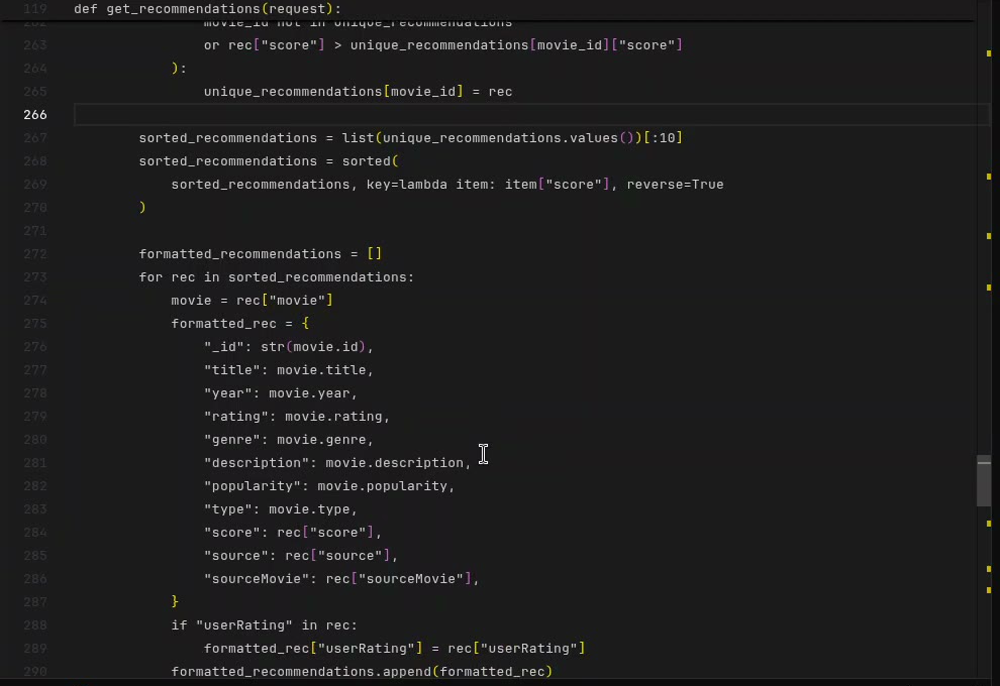

*41:40  0:22 left
    Bug 2's sort is fixed with 22 seconds left  — but the  [:10]  on the line
  above still slices before the sort, and Bugs 3 and 4 are untouched.*

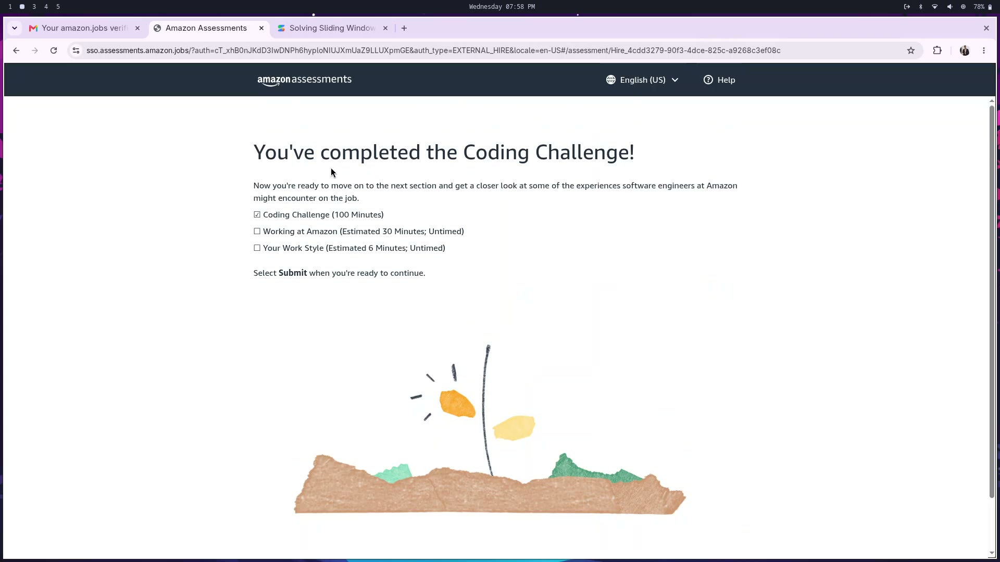

*42:20  expired
   Time up.*

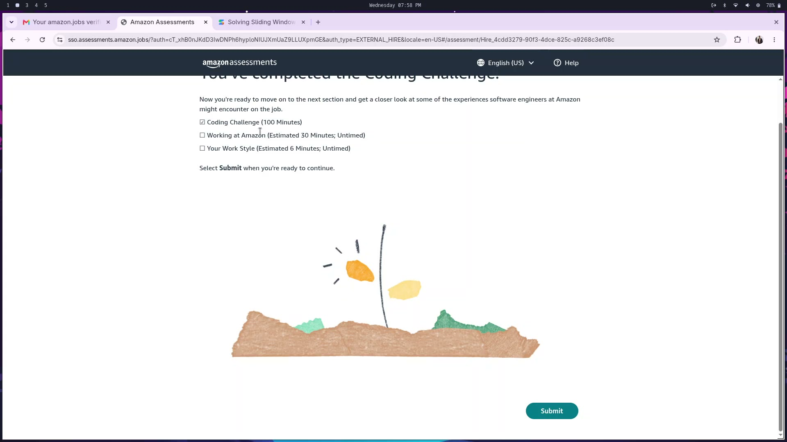

*42:24  expired
    What the whole assessment looks like.  Coding Challenge (100 minutes) → Working at
  Amazon (~30 min, untimed) → Your Work Style (~6 min, untimed). The 100 minutes is shared across
  the coding items, so time overspent on an earlier question is taken straight out of this
  one.*

### 8 · The correct solution

Everything from `rated_movies` / `watched_movies` collection upward was
already fine. This is the function with all four remaining bugs fixed:

```python
@csrf_exempt
@require_http_methods(["GET"])
@auth_middleware
def get_recommendations(request):
    try:
        user_id = uuid.UUID(request.user_id)
        user_ratings = list(Rating.objects.filter(user_id=user_id))

        rated_movies = []
        for r in user_ratings:
            if r.rating and r.rating >= 1:            # high AND low — low drives "different genres"
                try:
                    rated_movies.append({
                        'movie': Movie.objects.get(id=r.movie_id),
                        'rating': r.rating,
                        'movie_id': r.movie_id,
                    })
                except Movie.DoesNotExist:
                    pass

        watched_movies = []
        for r in user_ratings:
            if r.watched:
                try:
                    movie = Movie.objects.get(id=r.movie_id)
                    rated_entry = next(
                        (x for x in rated_movies if x['movie_id'] == r.movie_id), None)
                    watched_movies.append({
                        'movie': movie,
                        'movie_id': r.movie_id,
                        'rating': rated_entry['rating'] if rated_entry else None,
                    })
                except Movie.DoesNotExist:
                    pass

        # BUG 1 FIX — fire only when there is no activity at all
        if not rated_movies and not watched_movies:
            return JsonResponse({
                "message": "Start exploring movies by rating them or marking them "
                           "as watched to get personalized recommendations!",
                "recommendations": [],
            }, status=200)

        recommendations = []

        for entry in rated_movies:
            movie, user_rating = entry['movie'], entry['rating']
            pool = Movie.objects.filter(rating__gte=7.0).exclude(id=movie.id)[:50]

            if user_rating > 5:                                    # similar genres, 1.2x
                cands = [m for m in pool if any(g in m.genre for g in movie.genre)][:50]
                boost = 1.2
            else:                                                  # different genres, no boost
                cands = [m for m in pool if not any(g in m.genre for g in movie.genre)][:50]
                boost = 1.0

            for c in cands:
                matches = len([g for g in movie.genre if g in c.genre])
                genre_score = matches / max(len(movie.genre), 1)
                rating_score = c.rating / 10
                recommendations.append({
                    "movie": c,
                    "score": (genre_score * 0.7 + rating_score * 0.3) * boost,
                    "source": "rated",
                    "sourceMovie": movie.title,
                    "userRating": user_rating,          # only on source == "rated"
                })

        for entry in watched_movies:
            movie, movie_id = entry['movie'], entry['movie_id']
            if any(r["movie_id"] == movie_id for r in rated_movies):
                continue                                # rated signal takes precedence
            pool = Movie.objects.filter(rating__gte=7.0).exclude(id=movie.id)[:50]
            cands = [m for m in pool if any(g in m.genre for g in movie.genre)][:50]
            for c in cands:
                matches = len([g for g in movie.genre if g in c.genre])
                genre_score = matches / max(len(movie.genre), 1)
                rating_score = c.rating / 10
                recommendations.append({
                    "movie": c,
                    "score": genre_score * 0.7 + rating_score * 0.3,   # no boost
                    "source": "watched",
                    "sourceMovie": movie.title,        # note: no userRating key
                })

        unique = {}
        for rec in recommendations:
            mid = str(rec["movie"].id)
            if mid not in unique or rec["score"] > unique[mid]["score"]:
                unique[mid] = rec

        # BUG 2 FIX — sort with a key, then slice
        top = sorted(unique.values(), key=lambda r: r["score"], reverse=True)[:10]

        formatted = []
        for rec in top:
            m = rec["movie"]
            item = {
                "_id": str(m.id), "title": m.title, "year": m.year, "rating": m.rating,
                "genre": m.genre, "description": m.description,
                "popularity": m.popularity, "type": m.type,
                "score": rec["score"], "source": rec["source"],
                "sourceMovie": rec["sourceMovie"],
            }
            if "userRating" in rec:
                item["userRating"] = rec["userRating"]
            formatted.append(item)

        # BUG 3 FIX — == 0, not != 0
        if len(formatted) == 0:
            return JsonResponse({
                "message": "No recommendations found. Try rating more movies "
                           "or marking some as watched",
                "recommendations": [],
            }, status=200)

        # BUG 4 FIX — include the payload
        return JsonResponse({
            "message": f"Found {len(formatted)} personalized recommendations",
            "recommendations": formatted,
        }, status=200)

    except Exception as e:
        print(f"Get recommendations error: {e}")
        return JsonResponse({"message": "Server error"}, status=500)
```

### 9 · Timeline of the attempt

| Video | Left | What happened

| 00:00–06:00 | 42:00 | scrolling `views.py`, `urls.py`, `models.py`, README

| 06:10–06:30 | 35:50 | full algorithm + constraints table on screen

| 06:40–09:30 | 35:20 | **~3 minutes re-reading the same 30 lines** of collection loops

| 17:10 | 24:50 | **first `Run Tests` — 18 minutes in.** 0/6

| 18:30 | 23:30 | full failure output visible; diagnosis was available here

| 24:30 | 17:30 | Bug 1 accidentally **correct**… then reverted

| 25:10 | 16:50 | `rating__gte=7.0`, `exclude`, `1.2×` fixed ✓

| 26:50 | 15:10 | 2nd test run

| 30:10–30:30 | 11:40 | Bugs 3 + 4 on screen, scrolled past

| 32:30 | 9:30 | Bug 1 flipped to `!= 0 and != 0` — worse than the start

| 33:10 | 8:50 | 3rd run: now `assert 500 == 200` — a real crash, ignored

| 36:10 | 5:50 | Bug 1 finally correct ✓

| 38:10 | 3:50 | AI assistant names the `.sort()` bug

| 40:00 / 41:30 | 2:00 | last two test runs

| 41:50 | 0:12 | **`test_app.py` opened for the first time**

| 42:01 | 0:00 | time expires · 0/6 · Bugs 1(partially), 3, 4 + the slice still in the file

### 10 · What went wrong

- **Ran the tests at minute 18, read them at minute 41.** The tests *are* the
spec — they contain the exact expected strings. Reading them costs 3 minutes and hands you Bugs 1, 3
and 4 immediately.

- **Never read a traceback.** `assert 500 == 200` means the server threw.
The 500 survived from minute 17 to the end because I never looked at what raised it.

- **Edited by guessing, and flip-flopped.** Bug 1 was correct at 24:30, wrong at 32:30,
correct at 36:10 — because no test run separated the edits.

- **Re-read the same 30 lines repeatedly** instead of jumping to the
`return` statements, which is where a "data doesn't reach the UI" bug almost always is.

- **Used the AI assistant as a search engine, not a diagnostician.** It found Bug 2 —
at minute 36, after being asked to explain frontend components.

### 11 · The playbook for next time

>
**0–5 min — run the tests before reading any code.** The failure output is the
highest-information object in the exercise. It is free and it is first.

**5–10 min — read the test file, not the source.** Write down every expected string and
response shape. That list is your acceptance checklist.

**10–15 min — read the broken function backwards**, starting at the
`return` statements and walking up. Debugging projects hide bugs in exactly four places:
inverted comparisons (`!=`/`==`, `>`/`>=`), missing
response keys, sort/slice ordering, and off-by-one filters.

**Then: one bug, one test run.** Never make two edits without a run between them.

**Any 500 is priority zero.** It masks every other failure — get the traceback first.

**Ask the assistant for a diagnosis**: paste the failing output and ask "which line
raises this?" — not "explain this file".

Four one-line edits separated this from a pass. The gap was not knowledge of Django —
it was the order the 60 minutes were spent in.

