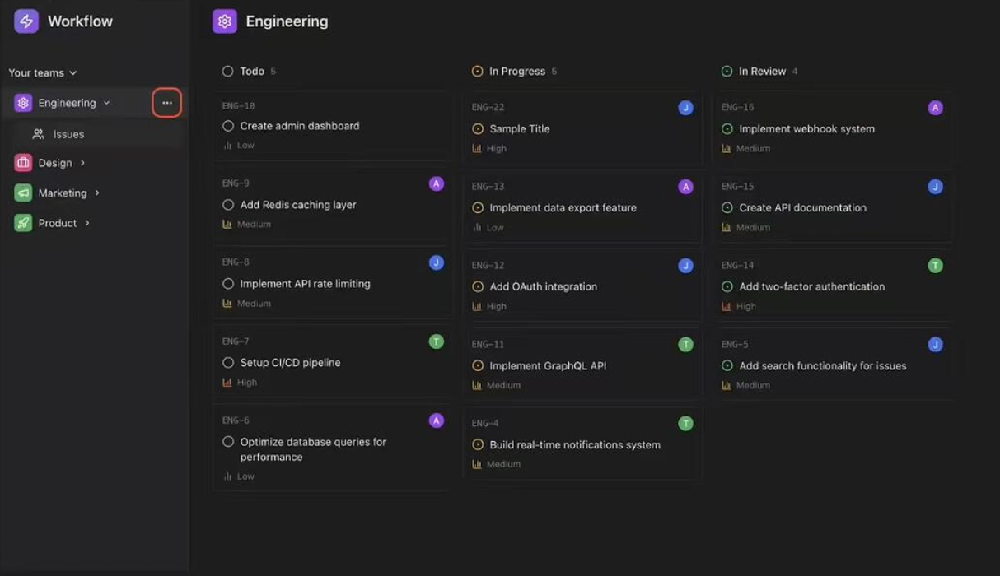
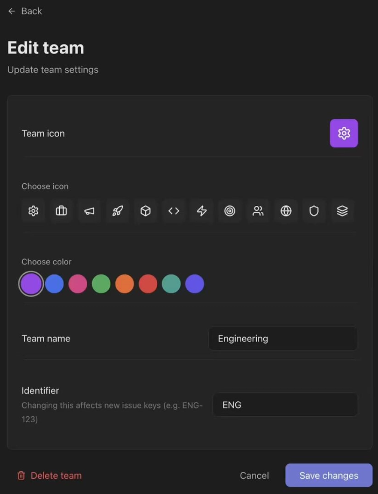
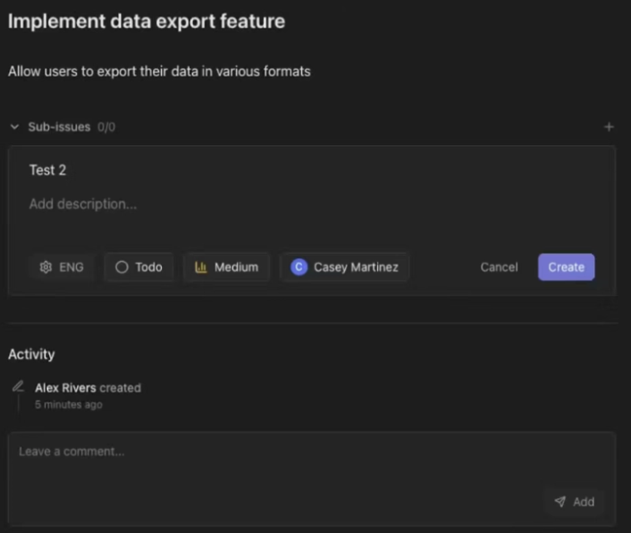
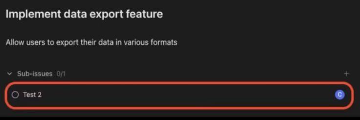
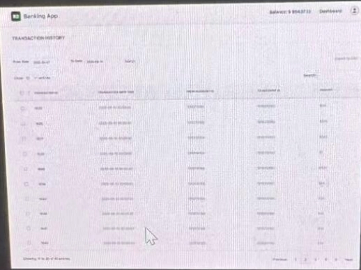
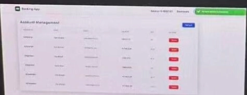

# Debugging projects (MovieDB, Workflow, Banking)

Full-stack debugging assessments: a Django/React app with a broken feature and a fixed time budget. Transcribed from screenshots, with the fix worked out afterwards.

---

## MovieDB — Search Is Broken (Question 2)
*Amazon OA · Debugging Projects · In-browser IDE (Java Spring Boot) · Question Description*

Question 2
MovieDB is an app that allows users to explore movies, submit ratings, and share reviews. The search functionality helps users find movies by title, actors, and various filters. Currently, the search feature is not working correctly on the backend, limiting users' ability to discover content.

### Issue #1: Basic search is case-sensitive and returns results only for exact title matches

The basic search feature is not functioning as intended. It only returns results when the entered query exactly matches a movie title, and it is currently case-sensitive. In addition, the search ignores the selected filter ('All', 'Title', 'Celebs') and always searches on titles only. This prevents users from discovering movies or celebrities, reducing the usefulness of the search experience.

#### Steps to Reproduce:

- Navigate to the search bar at the top of the page.

- Open the search type dropdown and select any option (All, Title, or Celebs).

- Enter a search query and observe the results.


*The search type dropdown*

### Issue #2: Advanced search is not working as intended

Advanced search does not surface matching movies and incorrectly reports no results.

#### Steps to Reproduce:

- Open the search type dropdown and select Advanced Search.

- Apply any combination of filters.

- Click the Search Movies button.

- Observe that the page always displays 'No Matching Results'.

### PROJECT_FILES_INSTRUCTIONS.md

```
## Read-only Files
The following files are marked read-only. You cannot edit these files
in the editor; however, it is possible from the terminal. You must not
modify or delete these files because doing so results in a zero score.

 * README.md
 * backend/src/main/java/com/moviedb/config/DataInitializer.java
 * backend/src/test/java/com/moviedb/controller/AdvancedSearchTest.java
 * backend/src/test/resources/application.yml
 * clean.sh
 * run.sh
 * setup.sh
```

### Answer

Hidden by default — open a hint first, and only then the full solution.

Hint 1 Where to start
Two separate issues. Issue #1 says search is case-sensitive, matches only exact titles, and ignores the selected filter. That is three defects in one query-building path.

Hint 2 The approach
Look for the repository/query method behind the search endpoint: an `equals` that should be a case-insensitive *contains*, and a filter parameter that is accepted by the controller but never threaded into the query. Issue #2 (advanced search always returning no results) is usually an `AND` chain that should skip unset filters.

Solution Full walk-through and code
**Issue #1 — basic search.** Three fixes in the search query path:

- exact match → substring match (`LIKE %q%` / `containsIgnoreCase`)

- case-sensitive → normalise both sides to lower case

- the `All` / `Title` / `Celebs` selector is ignored → branch on it and search titles, cast names, or both

**Issue #2 — advanced search always says "No Matching Results".** The usual planted cause is that every filter is applied unconditionally, so an unset filter compares against `null`/empty and eliminates every row. The fix is to build the predicate list dynamically, adding a clause only when that filter has a value.

Work the same order as any debugging project: run the tests, read the failing assertions, then follow the request from controller → service → repository and fix at the layer that owns the defect.

> **Inferred, not verified.** Only the question description was captured — the Spring Boot source and `AdvancedSearchTest.java` were never on screen. These are the standard causes for exactly these two symptoms, but the actual planted bugs could differ. Treat this as a search plan, not an answer.

Step by step Every number, calculated

No source was captured for this project, so nothing below claims to be the planted bug. What follows is the mechanism behind each symptom and the order to check things in — which is the transferable part anyway.

#### 1 · Read the symptom as a specification

Issue #1 states three separate failures in one paragraph. Separate them before touching code, because they live in different places:

| symptom | what it implies about the query | layer

| only exact title matches | equality comparison, not a substring match | repository / query

| case-sensitive | no normalisation on either side | repository / query

| filter selector ignored | the parameter never reaches the branch, or there is no branch | controller → service

The third is a different *kind* of bug from the first two: those are wrong SQL, this is a lost parameter. Fixing the query will not fix the dropdown, and a candidate who conflates them tends to fix one and declare victory.

#### 2 · Exact-match → substring, case-insensitively

In JPA the three common spellings, all equivalent:

```
// derived query method
List findByTitleContainingIgnoreCase(String q);

// JPQL
@Query("select m from Movie m where lower(m.title) like lower(concat('%', :q, '%'))")

// Criteria API
cb.like(cb.lower(root.get("title")), "%" + q.toLowerCase() + "%")
```

Two details that bite. **Normalise both sides** — lowering only the column still fails on a mixed-case query, and lowering only the query still fails on mixed-case data. And **the wildcards belong in the pattern, not the parameter**: `like :q` with `q = "%bat%"` works but hides the intent and breaks the moment someone passes a raw term.

#### 3 · The dropdown: one parameter, three branches

"All / Title / Celebs" has to arrive as a request parameter and reach a branch:

```
switch (type == null ? "ALL" : type.toUpperCase()) {
    case "TITLE":  return movieRepo.findByTitleContainingIgnoreCase(q);
    case "CELEBS": return celebRepo.findByNameContainingIgnoreCase(q);
    default:       return union(movies, celebs);      // "All"
}
```

Trace it end to end before assuming the branch is missing — the parameter is lost more often than the logic is. Check that the frontend sends it, that the controller declares it (`@RequestParam(required = false) String type`), and that the service signature actually takes it. A service method that never received the value cannot branch on it, and that is invisible if you start reading at the repository.

#### 4 · Issue #2: why "always no results" is a specific fingerprint

*Always* empty — even with no filters set — is the signature of a predicate that is **unconditionally applied**. An unset filter arrives as `null` or `""`, and comparing against it excludes every row:

```
// ✗ every filter always applied: one unset filter empties the result
where genre = :genre and year = :year and rating >= :minRating

// ✓ build predicates only for filters that have a value
List ps = new ArrayList<>();
if (genre  != null && !genre.isBlank()) ps.add(cb.equal(root.get("genre"), genre));
if (year   != null)                      ps.add(cb.equal(root.get("year"), year));
if (minRating != null)                   ps.add(cb.ge(root.get("rating"), minRating));
return cb.and(ps.toArray(new Predicate[0]));      // empty list => matches everything
```

Note the useful property of the corrected version: an empty predicate list ANDs to *true*, so "no filters" naturally returns everything. That is the behaviour the bug inverts.

The rival explanation for "always empty" is an AND that should be an OR, or a join that should be a left join (dropping every movie with no cast rows). Distinguish them in one step: **apply exactly one filter and see whether results appear.** Still empty → the join or a query-wide defect. Results appear → it was the unconditional-predicate bug.

#### 5 · The order to work in

- **Run the tests first, before reading any source.** `AdvancedSearchTest.java` is read-only, which makes it the specification — the assertion messages name the exact expected shapes.

- Fix Issue #1's query first: it is the smaller change and it validates your understanding of the data layer.

- For Issue #2, log the generated SQL (`spring.jpa.show-sql=true`) and read the `where` clause. A predicate against `null` is visible immediately, and this beats any amount of code reading.

- Re-run after each change. Debugging projects are scored on tests passed, so a partially fixed project still scores.

**Do not edit the read-only files.** The instructions say modifying them scores zero, and that includes "just adding a test".

---

## MovieDB (Django + React) — Movie Recommendations
*Amazon OA · Debugging Projects · In-browser IDE (Django + React) · Question Description*

MovieDB(Django+React): Movie Recommendations

### Overview

MovieDB is an online app that allows users to explore movies, submit ratings, and share reviews.

However, the recommendations personalized to the users are currently broken. Even after users share their preferences, the recommendations don't appear. Your task is to fix the backend for it.

### Expected API Behavior

#### GET /api/ratings/recommendations/user

**Purpose** Returns personalized movie recommendations based on the user's ratings and watched history.

**Auth**: Required (Bearer token)

**Success Responses (200 OK)**

With recommendations:

```
{
    "message": "Found 10 personalized recommendations",
    "recommendations": [
      {
        "_id": "movie_id",
        "title": "Movie Title",
        "year": 2023,
        "rating": 8.5,
        "genre": ["Action", "Thriller"],
        "description": "...",
        "popularity": 95,
        "type": "movie",
        "score": 0.85,
        "source": "rated"|"watched",
        "sourceMovie": "Inception",
        "userRating": 9
      },
      ...
    ]
}
```

No movies watched or rated yet:

```
{
    "message": "Start exploring movies by rating them or marking them as watched to get…",
    "recommendations": []
}
```

Some movies watched or rated, but no recommendations found:

```
{
    "message": "No recommendations found. Try rating more movies or marking some as watc…",
    "recommendations": []
}
```

#### POST /api/ratings/:movieId

**Purpose** Submit or update a user's rating for a movie.

**Auth:** Required (Bearer token)

**Request Body**

```
{
  "rating": 8 // 1-10 integer
}
```

**Success Responses (201/200)**

```
{
  "message": "Rating added/updated successfully",
  "rating": 8
}
```

#### GET /api/ratings/:movieId/user

**Purpose** Retrieve the user's personal rating and watched status for a movie

**Auth:** Required (Bearer token)

**Response Body (200)**

```
{
  "rating": 8,
  "watched": true
}
```

#### POST /api/ratings/:movieId/watched

**Purpose** Mark/unmark a movie as watched

**Auth:** Required (Bearer token)

**Response Body (201/200)**

```
{
  "message": "Movie marked as watched/unmarked",
  "watched": true
}
```

### Recommendation Algorithm

The scoring algorithm generates personalized movie recommendations based on user preferences:

| User Action | Recommendation Strategy | Score Multiplier

| Rated **high** (above 5) | Recommend movies with **similar genres** | 1.2x boost

| Rated **low** (5 or below) | Recommend movies with **different genres** | No boost

| Watched only (no rating) | Recommend movies with **similar genres** | No boost

| Watched + rated **high** | Recommend movies with **similar genres** | 1.2x boost

| Watched + rated **low** | Recommend movies with **different genres** | No boost

### Answer

Hidden by default — open a hint first, and only then the full solution.

Hint 1 Where to start
Do not read the code first. Run the tests, then read `test_app.py`. The failure messages name the exact strings the endpoint must return, and the tests pin the counts (10, then 2) and compare every field against a golden JSON fixture.

Hint 2 The approach
All four bugs sit in the last third of `get_recommendations`, around the `return` statements: two inverted `if` conditions, a `.sort()` that throws, and a response dict that is missing its payload key. The scoring loops in the middle are fine.

Solution The four bugs, with the corrected function
**This one is answered from a recording of the real attempt** — see
the frame-by-frame post-mortem for
the screenshots and the failing output.

#### Bug 1 — inverted no-activity guard

```
if len(rated_movies) != 0 and len(watched_movies) != 0:   # ✗ fires when the user HAS activity
if not rated_movies and not watched_movies:               # ✓
```

#### Bug 2 — sort throws, and slices before sorting

```
sorted_recommendations = list(unique_recommendations.values())[:10]   # ✗ slices first
sorted_recommendations.sort(reverse=True)                             # ✗ TypeError on dicts -> 500

sorted_recommendations = sorted(                                      # ✓ sort, then slice
    unique_recommendations.values(), key=lambda r: r["score"], reverse=True
)[:10]
```

`.sort()` on a list of dicts raises `TypeError: '<' not supported between
instances of 'dict' and 'dict'`; the bare `except Exception` swallows it and returns
500, which is why the tests report `KeyError: 'recommendations'` and later
`assert 500 == 200`.

#### Bug 3 — inverted empty-result guard

```
if len(formatted_recommendations) != 0:   # ✗ says "none found" when there ARE results
if len(formatted_recommendations) == 0:   # ✓
```

#### Bug 4 — the success response has no payload

```
return JsonResponse({                                    # ✗ no "recommendations" key at all
    "message": f"Found {len(formatted)} personalized recommendations"
}, status=200)

return JsonResponse({                                    # ✓
    "message": f"Found {len(formatted)} personalized recommendations",
    "recommendations": formatted,
}, status=200)
```

#### The scoring rules the fixtures pin down

- candidates must have `rating >= 7.0` and exclude the source movie itself

- `totalScore = (genreScore * 0.7 + ratingScore * 0.3) * multiplier`, multiplier 1.2 only for rated-high

- rated low (≤ 5) recommends *different* genres; watched-only and rated-high recommend similar

- a movie that is both rated and watched: the rated signal wins (skip it in the watched pass)

- dedupe by movie id keeping the higher score, sort descending, take 10

- `userRating` only on `source == "rated"`

The full corrected function is in the post-mortem entry.
4 one-line editsAll 6 tests

> Verified against the failing test output and the golden-fixture assertions captured on video; the corrected function was not itself run against the judge, because the exam had ended.

Step by step Every number, calculated

The four bugs above are verified from the recording. This panel explains *why those four symptoms looked the way they did*, and traces the scoring formula the endpoint is supposed to implement.

#### 1 · Reading the failure output backwards

The tests reported `KeyError: 'recommendations'` first and `assert 500 == 200` later. Those look like two problems and are really one chain, which is worth unpicking because the same shape recurs constantly:

**.sort()** on a list of dicts
   → TypeError: '<' not supported between instances of 'dict' and 'dict'
   → swallowed by a bare **except Exception**
   → handler returns **500**
   → the test reads response.json()["recommendations"] → **KeyError**

So the `KeyError` is not a missing-key bug at all — it is the *shadow* of an exception three layers up. **A bare `except` converts a precise error into a vague one**, and the first move in any project with one is to make it re-raise (or log the traceback) so the real exception surfaces. Doing that turns a confusing KeyError into a one-line TypeError that names the fix.

Bug 4 — the response literally lacking a `"recommendations"` key — produces the identical `KeyError` on the success path. Two different causes, one symptom: that is why the tests only went green once both were fixed, and why fixing one and re-running looked like no progress.

#### 2 · Sort before slicing, and sort by what

```
list(unique.values())[:10]   then  .sort(reverse=True)     # ✗ takes an arbitrary 10, then orders them
sorted(unique.values(), key=lambda r: r["score"], reverse=True)[:10]   # ✓
```

Two independent errors in one line. **Slicing first** takes whichever ten the dict happened to hold and then orders those — so the top-scoring movie is missing whenever it sits eleventh in insertion order. This is the kind of bug that passes a "returns 10 items" assertion and fails a golden-fixture comparison, which is exactly what the tests did. **Sorting dicts without a key** then raises, as above. Note also that `.sort()` returns `None` and mutates in place, so `x = y.sort()` is a third way to lose the data.

#### 3 · The two inverted guards

Bugs 1 and 3 are both boolean inversions, and both are invisible on a quick read:

| guard | written | fires when | should be

| no-activity early return | `if len(rated) != 0 and len(watched) != 0` | the user *has* both kinds of activity | `if not rated and not watched`

| empty-result message | `if len(formatted) != 0` | results *were* found | `if len(formatted) == 0`

Both also get the connective wrong: "no activity" is `not rated **and** not watched`, which by De Morgan is `not (rated **or** watched)` — the negation flips the operator. Writing the positive condition first and negating the whole thing is the reliable way to avoid this.

The tell for an inverted guard is a response that is *confidently wrong*: a user with plenty of ratings told they have no activity, or a "no recommendations found" message accompanying a populated list. If a message contradicts the data beside it, look for a flipped comparison rather than a data bug.

#### 4 · The scoring formula, and where its inputs come from

totalScore = (genreScore × **0.7** + ratingScore × **0.3**) × multiplier

Three independent decisions feed it, and the strategy table in the statement is really a lookup on the user's relationship to a source movie:

| user action | genres recommended | multiplier

| rated above 5 | similar | 1.2

| rated 5 or below | **different** | 1.0

| watched, no rating | similar | 1.0

| watched + rated high | similar | 1.2

| watched + rated low | **different** | 1.0

The last two rows encode a precedence rule that is easy to miss: when a movie is *both* rated and watched, **the rating wins** — so the watched pass must skip movies that already appeared in the rated pass, or the same source contributes twice with conflicting strategies. That is the "skip it in the watched pass" note in the solution.

Then the filters: candidates need `rating ≥ 7.0`, the source movie itself is excluded, results are deduped by movie id *keeping the higher score*, sorted descending, and capped at 10. `userRating` is emitted only when `source == "rated"`. Each of those is a separate assertion in the golden fixtures, compared field by field with a `< 0.2` tolerance on the score — so a formula that is right in shape but wrong in a weight fails loudly rather than silently.

> The exact definitions of `genreScore` and `ratingScore` were never fully on screen — the README's Variable / Definition / Range table was scrolled past before it rendered. The weights, the multiplier, the 7.0 threshold and the precedence rule above *are* captured; the two component formulas are not.

#### 5 · The method that actually mattered

All four bugs sat in the last third of the function, around the return statements, while the scoring loops in the middle were correct. That is the general shape of these exercises: **the planted bugs cluster in the plumbing, not the algorithm**. Concretely, for a 60-minute debugging project:

- **Run the tests before reading any code.** The assertions are the specification and they name exact strings and counts.

- **Neutralise bare `except` blocks first** so real exceptions surface. This one step would have turned the whole confusing failure chain into a named TypeError.

- **Read the return statements and the guards around them** before the business logic.

- **Re-run after every single edit.** Scoring is per test passed, so partial fixes still earn marks — and with interacting bugs (here, two causes of one KeyError) you need to know which change moved which test.

---

## Workflow — Edit / Delete Team (Question 2)
*Amazon OA · Debugging Projects · In-browser IDE · Question Description*

Question 2
Workflow is an app that allows teams to manage and track their work efficiently. The team management feature lets admins create teams, view team details, edit team information, and delete teams when needed. However, the edit and delete team features are not functioning correctly in the backend, and your task is to fix them.

### Issue Summary:

Admins can edit team information or delete a team and see a success message, but the updated data does not appear on the screen.

### Steps to Reproduce:

- Log in using Admin credentials:

```
Email: alex@workflow.dev
Password: Password@123
```

- Hover over any team in the left sidebar.

- Click the ⋯ menu.



*The Engineering team board*

- Choose Edit, update the team information, then click Save changes, or choose Delete to remove the team.



*Edit team — the fields under test*

- Notice the team in the sidebar does not update to reflect your changes (or does not disappear after deletion).

### Expected Behavior:

- When an admin edits a team's information (*name, key, icon, iconColor*), the updated team details should be saved and reflected immediately in the sidebar.

- When an admin deletes a team, it should be removed from the sidebar immediately and should no longer appear anywhere in the app.

Refer to the README.md file for more details.

> **Note:** The acceptance criteria for this task require that your solution pass all predefined unit tests. Use failing test cases to guide debugging.

### Answer

Hidden by default — open a hint first, and only then the full solution.

Hint 1 Where to start
The symptom is precise: the API reports success, but the sidebar does not change. So the write succeeded and something about what is returned or re-read is wrong — not the update itself.

Hint 2 The approach
Two classic causes: the update handler saves but returns the *stale* object (or no body), so the client re-renders old data; and the delete handler removes the row but the list endpoint still serves a cached/unfiltered collection. Check what each handler returns, not just what it writes.

Solution Full walk-through and code
**Edit team.** Verify the handler (a) applies every field the form sends — `name`, `key`/identifier, `icon`, `iconColor`, not just the name — and (b) returns the *updated* entity so the client's store refreshes. A handler that saves then returns the pre-update copy produces exactly "success message, no visible change".

**Delete team.** Check for a soft-delete flag that the list query does not filter on, or a delete that removes the team but leaves the sidebar's cached membership list intact.

Expected behaviour per the statement: edits are saved *and reflected immediately in the sidebar*; a deleted team disappears from the sidebar and from everywhere in the app.

> **Inferred, not verified.** Only the question description and two UI screenshots were captured; the backend source was never shown. Use the failing unit tests in the real environment to locate the defect.

Step by step Every number, calculated

Only the question description and UI screenshots were captured — no backend source. Below is the mechanism behind this precise symptom, not a claim about the planted bug.

#### 1 · "Success message, but nothing changes" is a narrow fingerprint

That combination rules a lot out immediately. A success response means the request reached the handler, passed validation and authorisation, and returned 2xx — so the bug is *after* the decision to succeed. Exactly four mechanisms produce it:

| # | mechanism | how to confirm in one step

| A | the write never persisted (no flush/commit, or a detached entity) | **reload the page.** Still old → A

| B | persisted, but the response returns the stale pre-update object | reload shows the change; the API response body does not

| C | persisted and returned, but the client never refreshes its store | response body is correct; only the UI is stale

| D | persisted, but the list query filters it out (soft delete, cache) | the item is gone from the list but still fetchable by id

**Reloading the page is the single highest-value action here**, and it costs three seconds. It splits the four candidates into {A} versus {B, C, D} before you have read a line of code. Candidates routinely skip it and spend twenty minutes reading the wrong layer.

#### 2 · Mechanism A — the write that is not a write

In JPA the classic version is mutating an entity that is no longer managed, or building a fresh object with the same id and never calling save:

```
// ✗ team is detached: the setters change an object nobody is watching
Team team = new Team(dto.getId(), dto.getName());
team.setName(dto.getName());
return ResponseEntity.ok("Team updated");        // truthfully reports nothing

// ✓ load the managed entity, mutate it, save inside a transaction
@Transactional
public Team update(Long id, TeamDto dto) {
    Team team = repo.findById(id).orElseThrow();
    team.setName(dto.getName());
    team.setKey(dto.getKey());
    team.setIcon(dto.getIcon());
    team.setIconColor(dto.getIconColor());
    return repo.save(team);
}
```

A missing `@Transactional` on a method that relies on dirty checking gives exactly this: no exception, no rollback message, no change.

#### 3 · The field-by-field check the statement is hinting at

The Expected Behavior names four fields explicitly — **name, key, icon, iconColor**. That enumeration is unlikely to be decorative. A handler that copies only `name` produces a *partially* working edit: the rename appears, the icon change does not. Compare the DTO's fields against the setters actually invoked, one line at a time, and check the mapper too if one is involved — a `@Mapping(ignore = true)` or a missing field in a MapStruct/ModelMapper config produces the same silent drop.

This is also why "it works for name" is not evidence the edit path is fine.

#### 4 · Delete: the two failure shapes

The statement asks for two distinct things — the team disappears from the sidebar, and it "should no longer appear anywhere in the app". That phrasing suggests the planted bug leaves a trace somewhere:

- **Soft delete not filtered.** The row gets `deleted = true` but the list query has no `where deleted = false`. The team vanishes from one screen and survives on another.

- **Orphaned associations.** The team row goes but memberships, issues or board references remain, so the sidebar (which may render from memberships, not from teams) still shows it. Fix with cascade or by clearing the join rows explicitly.

- **Foreign-key violation swallowed.** A `try/catch` that logs and returns success turns a constraint failure into a green toast. Search the handler for a bare `catch`.

That last one deserves a habit: in any debugging project, **grep for empty or over-broad catch blocks first**. They are the standard device for hiding a real exception behind a success path, and they explain "success message but no effect" better than anything else.

#### 5 · Working order

- Reload after an edit — split A from B/C/D.

- Look at the actual HTTP response body in the network tab; that splits B from C.

- Query the database directly for the row; that confirms persistence independently of both.

- Only then read the handler, and read it against the four named fields.

Each step is seconds and eliminates a branch. The task is backend-only ("fix them in the backend"), so if the response body is already correct and only the UI is stale, re-read the brief before editing frontend state.

---

## Workflow — Issue & Sub-Issue Creation
*Amazon OA · Debugging Projects · In-browser IDE · Question Description*

### Issue #1: New issues do not appear on the board

- Notice that the issue is not appearing on the board.

When a new issue is created, it should appear immediately on the team board with a unique identifier (e.g., ENG-1, DES-2). The issue identifier should follow the format **TEAM_KEY-NUMBER** and auto-increment for each team independently.

### Issue #2: Sub-Issue creation is not working

#### Steps to Reproduce:

- Log in using the following test credentials:

```
Email: alex@workflow.dev
Password: Password@123
```

- Click on any existing issue from the board to open the issue detail page.

- Click on the Add Sub-Issue button.

- Fill in the sub-issue details and click the Create button.

- Notice that the sub-issue is not appearing in the sub-issues list.



*Creating a sub-issue*



*Expected after the fix — the new sub-issue appears in the parent’s Sub-issues list (0/1)*

When a sub-issue is created, it should appear in the sub-issues section of the parent issue detail page.

```
Implement data export feature
Allow users to export their data in various formats

  ▼ Sub-issues 0/1                                        +
  ( ) Test 2                                              (C)   ← expected
```

### Answer

Hidden by default — open a hint first, and only then the full solution.

Hint 1 Where to start
The sub-issue is created (no error) but does not appear under its parent. So the write happened — what links a child to its parent, and who reads that link?

Hint 2 The approach
Either the parent id is not persisted on the child (dropped in the DTO or never mapped), or it is persisted but the parent-detail query does not select children. The counter reading `0/0` before and `0/1` after in the two screenshots tells you which side to look at first.

Solution Full walk-through and code
Trace the create path: request body → DTO → entity. The `parentId` (or `parentIssueId`) is the field to follow — if it is missing from the DTO or not set on the entity, the child is created as a top-level issue and will never show under the parent.

Then trace the read path: the parent-issue detail endpoint must return its sub-issues, and the sub-issue counter must count them. The screenshots show the expected end state — the new sub-issue listed under *Sub-issues 0/1*.

> **Inferred, not verified.** Question description and UI screenshots only; no backend source was captured.

Step by step Every number, calculated

Question description and UI screenshots only; no backend source was captured. What follows is mechanism and method.

#### 1 · Two issues, one shared question

Both symptoms are "I created something and it is not in the list". For any create-then-list defect there are exactly three places the object can be lost, and naming them turns the search into three checks instead of a code read:

create request → [1] **written?** → [2] **written with the right fields?** → [3] **the list query returns it?**

Check them in that order, because each one makes the next meaningful. Query the database directly after the create: no row means [1]; a row with a null or wrong column means [2]; a correct row that the endpoint still omits means [3].

#### 2 · Issue #2: follow `parentId`, field by field

A sub-issue differs from an issue in exactly one respect — it has a parent. So the whole bug surface is that one field, and it can be dropped at any of four hand-offs:

| hand-off | failure | result

| frontend → request body | not sent, or sent under another name | server never sees it

| request body → DTO | field absent from the DTO class | silently deserialised as null

| DTO → entity | `setParent` never called | row created with parent_id NULL

| entity → response/list | parent's detail query does not fetch children | row correct, list wrong

The third row is the one that matches the reported symptom most cleanly: a sub-issue created with `parent_id = NULL` is a perfectly valid *top-level* issue. It would not appear under the parent — and it would quietly appear on the main board, which is worth checking, because seeing it there is strong evidence for this mechanism specifically.

Watch for the name mismatch too: `parentId` in JSON versus `parentIssueId` on the DTO. Jackson binds by name and ignores unknown properties by default, so a rename produces a null with no error anywhere.

#### 3 · Issue #1: created but not on the board

If the row exists and is correct, the defect is in the read path, and the usual causes are all filters the creator did not satisfy:

- **Status or column not set.** A board groups by status; an issue created with a null status belongs to no column and renders nowhere.

- **Board / project / team association missing**, so the board's `where board_id = ?` excludes it.

- **Sub-issues excluded by design.** If the board query filters `parent is null`, then a bug in Issue #2 that *sets* a parent wrongly would remove the issue from the board — which would make the two reported issues the same bug seen from two screens. Worth explicitly ruling in or out, since it changes the fix from two to one.

#### 4 · Let the tests drive it

The entry's screenshot shows a test list with the expected end state — the new sub-issue under *Sub-issues 0/1*. In these projects the tests are the specification, and the counter in that label is a second assertion: it is computed from the children collection, so a fix that creates the row but does not wire the association will move the list and not the counter, or vice versa. If the counter and the list disagree after your fix, you have found a second defect rather than finished the first.

---

## Banking App — Role-Based Access Control (RBAC)
*Amazon OA · Debugging Projects · In-browser IDE (Spring Boot + Angular) · Question Description*

The Banking App lets users send and receive money, but it has security flaws that allow unauthorized access to other accounts. Users are able to view transactions that do not belong to their accounts.

Your task is to fix the access control on the backend to ensure the expected behavior below:

- Users can only access transaction history related to their own accounts.

- Admins can view all user accounts and transactions. They also have the permissions to delete other user accounts.

### Steps to Reproduce:

- Log in as a user (Email: yalen@gmail.com, password: yalen123)

- From the user icon in the navbar, select Transactions and notice that transactions from other users' accounts are being displayed (for example, account 1010113169).



*Transaction history showing other users' accounts*

- Log in as an admin (Email: david@gmail.com, Password: david123)

- From the user icon in the navbar, select All Accounts. When you try to delete a specific account as an admin, the action appears successful, but the account is not actually deleted.



*Account Management — delete reports success but does nothing*

Refer to the README.md file for implementation details.

> **Note:** The acceptance criteria for this task require that your solution pass all predefined unit tests.

### README.md — Banking App: Role-Based Access Control (RBAC)

#### Overview

The Banking App is built with a Java Spring Boot backend and Angular frontend, enabling users to transfer and receive money.

The repository may intentionally contain other issues unrelated to this specific task. Please focus on the described task requirements and address bugs or errors associated with them.

#### Expected API Behavior

#### POST /api/core-banking/auth/signin

**Purpose** Authenticate user and receive JWT token for subsequent requests.

**Request Body**

```
{
  "emailAddress": "string",
  "password": "string"
}
```

**Success Response (200 OK)**

```
{
  "name": "Bearer",
  "value": "eyJhbGciOiJIUzI1NiIsInR5cCI6IkpXVCJ9..."
}
```

#### POST /api/core-banking/transaction

**Purpose** Create a new transaction between accounts.

**Headers**

```
Authorization: Bearer YOUR_JWT_TOKEN
```

**Request Body**

```
{
  "fromAccountId": 1111213169,
  "toAccountId": 1111213170,
  "transferAmount": 100.00
}
```

**Success Response (201 Created)**

```
{
  "transactionId": 1042,
  "fromAccountId": 1111213169,
  "toAccountId": 1111213170,
  "transferAmount": 100.00,
  "dateCreated": "2024-01-15 10:30:00"
}
```

**Error Responses**

- Unauthorized access (401)

```
{ "error": "Authentication required" }
```

#### GET /api/core-banking/transaction/transactionHistory?fromDate=2024-01-01&toDate=2024-01-31

**Purpose** Get current user's transaction history within date range.

```
Authorization: Bearer YOUR_JWT_TOKEN
```

**Success Response (200 OK)**

```
[
  {
    "transactionId": 1042,
    "accountId": 1111213169,
    "fromAccountId": 1111213169,
    "sourceCardNumber": "1234567890123456",
    "toAccountId": 1111213170,
    "transferAmount": 100.00,
    "dateCreated": "2024-01-15 10:30:00",
    "lastCreated": "2024-01-15 10:30:00"
  },
  {
    "transactionId": 1043,
    "accountId": 1111213169,
    "fromAccountId": 1111213169,
    "sourceCardNumber": "1234567890123456",
    "toAccountId": 1111213171,
    "transferAmount": 250.50,
    "dateCreated": "2024-01-16 14:20:00",
    "lastCreated": "2024-01-16 14:20:00"
  }
]
```

#### GET /api/core-banking/transaction/transactionHistory/accounts/{accountId}?fromDate=2024-01-01&toDate=2024-01-31

**Purpose** Get any user's transaction history within date range (Admin only). Ensure users cannot access this.

```
Authorization: Bearer YOUR_JWT_TOKEN
```

**Success Response (200 OK)**

```
[
  {
    "transactionId": 1042,
    "accountId": 1111213170,
    "fromAccountId": 1111213170,
    "sourceCardNumber": "1234567890123456",
    "toAccountId": 1111213169,
    "transferAmount": 100.00,
    "dateCreated": "2024-01-15 10:30:00",
    "lastCreated": "2024-01-15 10:30:00"
  }
]
```

**Error Responses**

- Unauthorized access (401)

```
{ "error": "Authentication required" }
```

- Insufficient permissions (403)

```
{ "error": "Admin access required" }
```

### Answer

Hidden by default — open a hint first, and only then the full solution.

Hint 1 Where to start
Both symptoms are authorization failures, in opposite directions: a normal user *sees too much*, and an admin's delete *does too little* while reporting success.

Hint 2 The approach
For the transaction history: the query almost certainly filters by a request parameter instead of the authenticated principal, so any account id in the URL is honoured. For the delete: the endpoint returns 200 without checking the role, or checks it and swallows the failure — look for a missing `@PreAuthorize` and for a delete that is never committed.

Solution Full walk-through and code
**Leaked transaction history.** The endpoint should scope results to the authenticated user's own accounts, derived from the JWT, not from a client-supplied account id. Fix by resolving the principal server-side and filtering on it — and reject (403) rather than silently returning another user's rows.

**Delete reports success but does nothing.** Two things to check: the method needs a real role guard (admin only), and the delete must actually be applied and flushed — a common plant is a repository call on a detached entity, or a soft-delete flag the list query ignores.

The README in the challenge defines the full API contract (signin, transaction, transactionHistory with date range, account management); align each handler's authorization with it, then let the predefined unit tests drive the remaining detail fixes.

> **Inferred, not verified.** The question description and two photographed screens were captured; the Spring Boot + Angular source was not. Authorization bugs in these exercises are usually exactly these two shapes, but confirm against the failing tests.

Step by step Every number, calculated

Question description and UI screenshots only; the Spring Boot / Angular source was not captured. Below is mechanism and method — and, for this topic, the security reasoning that must not be skipped.

#### 1 · Two distinct checks that get confused

Role-based access control tasks always contain two questions, and conflating them is the classic failure:

| check | question | example

| **Authorisation by role** | is this *kind* of user allowed to call this endpoint at all? | only an admin may delete accounts

| **Ownership** | is this *particular* user allowed to touch this *particular* row? | a user may read only their own transactions

A role check alone lets any logged-in user read any other user's transactions by changing an id in the URL — the textbook *insecure direct object reference*. An ownership check alone lets a non-admin call an admin-only endpoint on their own data. The statement asks for both: *"users can only access transaction history related to their own accounts"* and *"admins can view all… and delete other user accounts"*.

#### 2 · The rule that makes ownership checks correct

There is one non-negotiable principle, and it is where most implementations go wrong:

**Take the identity from the authenticated principal, never from the request.**

```
// ✗ trusts the client: anyone can pass someone else's id
@GetMapping("/transactions")
List list(@RequestParam Long userId) { return repo.findByUserId(userId); }

// ✓ identity comes from the token; the client cannot choose it
@GetMapping("/transactions")
List list(Authentication auth) {
    Long me = ((UserPrincipal) auth.getPrincipal()).getId();
    return repo.findByUserId(me);
}
```

Where an id must appear in the path (`/accounts/{id}/transactions`), it has to be *verified* rather than trusted:

```
Account acct = repo.findById(id).orElseThrow(NotFound::new);
if (!acct.getOwnerId().equals(me) && !isAdmin(auth)) throw new ForbiddenException();
```

Note the admin escape hatch is part of the same expression — that is what lets admins see everything without a second code path that could drift out of sync.

#### 3 · Where the check has to live

Frontend hiding is not access control. If the Angular app merely hides the Delete button for non-admins, the endpoint is still reachable with curl. The task says "fix the access control **on the backend**" for exactly this reason. Enforce on the server; treat any UI change as cosmetic.

In Spring the usual mechanisms, cheapest first:

```
@PreAuthorize("hasRole('ADMIN')")                       // pure role check
@PreAuthorize("hasRole('ADMIN') or #id == authentication.principal.id")   // role or ownership
// or an explicit check in the service, as above, when the rule needs a DB lookup
```

If `@PreAuthorize` appears in the codebase but does nothing, check that method security is actually enabled (`@EnableMethodSecurity`, formerly `@EnableGlobalMethodSecurity(prePostEnabled = true)`). A silently inert annotation is a very common planted bug, and it looks correct on inspection.

#### 4 · The matrix to test

Two roles times two ownership situations gives four cases, and a fix is only done when all four hold. Fill this in against the real app with the supplied credentials:

| actor | own account | another user's account | delete another user

| user (yalen@gmail.com) | allow | **deny — 403** | **deny — 403**

| admin | allow | allow | allow

The two highlighted cells are the ones a broken implementation passes accidentally, because the UI never issues those requests. Test them by hand — change the id in the URL, or replay the request with the other account's token. If a user can read another user's transactions, nothing else you fixed matters.

One refinement worth knowing: returning **404 rather than 403** for a resource the caller may not see avoids confirming that it exists. Follow whatever the project's tests expect — but if the tests are silent, 403 is the more common expectation in these exercises.

