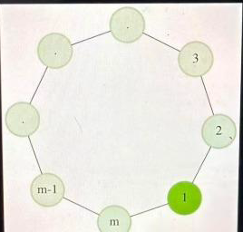

# Amazon OA Practice

Open `site/index.html` in a browser (double-click it, or `firefox site/index.html`).
Everything is local — the images load from `../images/`.

## What's in it
56 items — transcribed from the screenshots in `images/`, several supplied as text, and 1 rebuilt
from a screen recording of an actual attempt:

| Section | Count |
|---|---|
| Amazon OA · Coding | 15 |
| Amazon OA · Work Simulation | 2 |
| Amazon OA · Debugging Projects | 6 |
| Siemens · HackerEarth Java Test | 5 |
| FastPrep · Reported Amazon OA | 27 |
| Notes (the text you wrote in the doc) | 1 |

## The attempt post-mortem
`#moviedb-recs-postmortem` (in *Debugging Projects*, right after the question it belongs to) is
rebuilt frame-by-frame from `2026-06-24 19-15-53.mp4` — the 42:52 screen recording of the real
60-minute MovieDB attempt. The recording has no audio track, so every fact in it was read off the
screen via frame extraction + OCR.

It carries 18 stills (`images/vid-*.png|jpg`), each stamped with **two clocks**: its position in the
video and the exam time remaining at that instant (`remaining ≈ 42:02 − video time`, verified against
the on-screen timer at 03:40 and 38:20). The entry ends with the corrected `get_recommendations`
and a minute-by-minute playbook.

To add stills from another recording: extract the frame, drop it in `images/` as
`vid-<mmss>-<slug>.png`, and reference it from the body with

```html
<figure class="vshot">
  
  <figcaption><span class="ts">09:30</span><span class="ts left">32:32 left</span>
  <span><b>Headline.</b> What to notice.</span></figcaption>
</figure>
```

`.vshot`, `.bug`/`.fixed` and `table.tl` are styled in `index.html`; clicking any `.vshot` image
opens the lightbox (wired in `app.js`).

## Answers (hidden by default)
52 of the 56 entries end in an **Answer** section built from three collapsed `<details>` panels —
*Hint 1* (where to start), *Hint 2* (the approach), then *Solution* (walk-through, complexity chips
and Python code). Nothing is visible until you click, so a problem still reads cold. The four
without answers are the two behavioural questions, the notes page, and the post-mortem (which is
itself an answer).

Markup is plain `<details>`/`<summary>` — no JavaScript. Styling lives under `.ans` in `index.html`.

### Step-by-step panels (Sept 2026)

Entries are gaining a fourth panel after *Solution* — **Step by step · Every number, calculated** —
which derives each formula, says where every `± 1` comes from, and traces the published sample
numerically to the stated answer. Markup:

```html
<details class="deep"><summary><span class="k">Step by step</span>Every number, calculated</summary>
<div class="inner">
  <div class="step"><h4>1 · Heading</h4> …prose… <div class="formula">monospace derivation</div></div>
  <table class="trace">…numeric trace, class="hit" on the winning row…</table>
</div></details>
```

`.deep`, `.step`, `.formula` and `table.trace` are styled under `.ans` in `index.html`. **Every
solution gets executed against its published samples before its panel is written** — that pass has
already found five wrong solutions (see below).
To add one, append this before an entry's closing backtick:

```html
<div class="ans"><h3>Answer</h3>
<p class="lede">Hidden by default — open a hint first, and only then the full solution.</p>
<details class="hint"><summary><span class="k">Hint 1</span>Where to start</summary>
  <div class="inner">…</div></details>
<details class="sol"><summary><span class="k">Solution</span>Full walk-through and code</summary>
  <div class="inner">…<span class="cx">Time O(n)</span><pre class="sample"><code>…</code></pre></div></details>
</div>
```

**Confidence is marked.** Where a statement was cut off or paywalled, the solution panel ends in an
amber `.unsure` box saying exactly what is unverified.

**Every solution was executed against its published samples.** That pass found **eleven wrong
solutions**, plus eight stub-name mismatches and several source contradictions. All are corrected;
each `.unsure` box records what changed.

| Problem | Was | Now |
|---|---|---|
| Min Cost to Make Stations Equal | `i*v + (n-1-i)*v` — the `i` cancels; **failed both its own samples** (4, 2 vs. 3, 1) | keep the best maximal run: `min over runs of v*(l + n-1-r)` |
| Warehouse Containers in a Circle | median of prefix sums → returned 4 where the statement says 7 | direction is fixed, so `min(Σ(P−min P), Σ(max P−P))` = min(7, 8) |
| Flash Sale Allocation | round-robined across all bid tiers → `[]` instead of `[4]` | tiers strictly by bid; round-robin only within a tie |
| Unfulfilled Bids | same tier bug, **plus** `0 < got < want` excluded customers who got *nothing* → `[2]` instead of `[1,2]` | group by bid amount; filter is `got < want` |
| Minimum Errors (wildcards) | per-character greedy; `"1!0!!!!"`, x=9, y=4 → 40 vs. true 24 | exchange argument ⇒ single threshold; O(n) with prefix sums |
| Max Money in k Bags | anchored only the window's left edge; wrong on ~9% of random inputs | anchors left *and* right edges (2n candidates) |
| Smallest Base Segment | unterminated string literal (wouldn't compile) + exponential recursion | binary-search the replication count `r` |
| Homework — M-th Smallest Distance | used `max(...)` where the statement says `min(...)`; the recorded 51-window heuristic is wrong on **397/400** random cases | binary search + inclusion–exclusion with a Fenwick tree |
| Function on Factorial | generic factorial/inverse scaffolding that never addressed the problem | `f(x)` = count of even divisors; Legendre ⇒ `a · Π(e_p+1)` |
| Find First Unique | returned the *character* instead of the 1-based index | returns `i + 1` |
| Maximum System Memory | acknowledged placeholder; returned 6 on a `→ 3` example | sort descending, sum every second element |
| Count Promotional Periods | correct but O(n²), and n ≤ 2·10⁵ | O(n) monotonic stack (0.04 s at n = 200 000) |

**Source contradictions found** (flagged inline, not silently "fixed"):

- **Minimum Errors, Sample 0** — STDIN says `y = 3`, the FUNCTION block says `y = 2`, and the
  explanation's `2×1 + 3×2 = 8` confirms **3**. With y = 2 the answer is 6.
- **Maximum Quality Score** — header says `impactFactor = 3`; every table row computes with **2**.
  Correct answers: 12 for factor 2, 18 for factor 3.
- **Minimum Grid Inconvenience** — the statement defines *Chebyshev* distance, but Example 1's
  answer of 2 is only reachable under *Manhattan* (Chebyshev gives 1).
- **Calculate Beauty Values** — the definition of "beauty" is paywalled, and **no** tested reading
  reproduces the published 12 (Σ(max−min) over all subarrays gives 51). Left explicitly unresolved.
- **Smallest Base Segment** — with the Returns clause cut off, it is undetermined whether the base
  may contain letters absent from `missingData`; the two readings differ (`"zz"` vs `"az"`).

**Twelve stub-name mismatches** — where the published code defined a different function name or
signature from the declared stub, so the editor's starter code would not have matched: `circular`,
`flashsale`, `drone`, `sie-homework`, `sie-junction`, `sie-span`, `billing`, `fp-distinctpairs`,
`fp-memory`, `fp-beauty`, `fp-nondecreasing`, `fp-unfulfilledbids`.

One further pairing worth knowing:

- **Optimal Inventory** vs. **Minimum Contiguous Replacements** — same validity rule, different cost
  (elements changed vs. operations). The two answers differ; each panel points at the other.

Every solution with a published sample is now executed against it — 44 assertions across 28
problems, all passing. Where a sample was absent or ambiguous, the solution was checked against a
brute-force reference instead (exhaustive enumeration, Dijkstra over reachable states, or an O(n²)
baseline, depending on the problem); the `.unsure` boxes say which.

## Using it
- **Text size** — `A−` / `A+` at the right of the problem header (or `-` / `+` anywhere outside the
  editor) resize the whole statement — prose, tables, code samples, answer panels. 13–26 px,
  default 17, remembered across sessions. Everything scales off one `--pfs` variable.
- **Left rail / hamburger** — jump between problems. Orange ticks separate sections.
- **Figures** — every problem that had a diagram in its screenshot shows that diagram inline,
  at the point in the text where it belongs. Click one to open the full source screenshot.
- **Show original screenshots** — appends the source images at the bottom of the problem so you can
  check the transcription. Click an image to open it full size.
- **Timer** — starts paused at the problem's nominal length; click it to start/pause, "Reset timer"
  to restart. Each problem keeps *its own* clock, so leaving to check another question and coming
  back does not lose your time.
- **Editor** — CodeMirror 5, **Python only**. Code is autosaved per problem (in `localStorage`, and
  mirrored to the server when served by the Docker image — see "Persistence" below);
  "Reset to stub" reloads the signature. The other three languages were removed so the editor could
  be tuned for one: see below. (Any Java/C++/JS code you saved earlier is still in `localStorage`
  under `code:<id>:<lang>` and still comes out in an export — it just isn't reachable from the UI.)

### The Python editor

  - **Indentation behaves like a real editor.** Tab moves to the next 4-column *stop* rather than
    always inserting four spaces (at column 6 you get 2 spaces, not 4). Tab with a selection indents
    the block, Shift-Tab dedents. Backspace inside leading whitespace deletes a whole level.
  - **Enter** keeps the block indent, adds a level after `:` (the mode does that), and *removes* one
    after `return` / `pass` / `break` / `continue` / `raise`.
  - **Completion** — Ctrl-Space, and automatically after two word characters or a `.`. It offers
    keywords, builtins, identifiers already in your buffer, and members of the modules these
    problems actually use (`collections`, `itertools`, `heapq`, `bisect`, `functools`, `math`, `re`,
    `random`, `string`, `sys`). The full stdlib vocabulary (176 modules' public members) is known;
    typed receivers are resolved — `d.` after `d = {}` or `d = deque()` offers that type's methods
    (plus `str`/`list`/`dict`/`set`/`tuple`/`int`/`float`/`bytes`), `self.x` assignments become
    `self.` completions, `from x import ` proposes that module's members, and typing a block
    keyword (`def`, `cla…`, `for`, `while`, `with`, `try`) pre-fills its skeleton. Entries are ranked
    so a module's own members outrank the generic method list, and it never fires inside a string or
    a comment. Registered as `CodeMirror.hint.python`.
  - **Vim mode** — the `Vim` button in the editor header, or **Ctrl-Alt-V** from anywhere. The
    button shows the current mode. Setting persists. `:w` flushes the autosave. Tab, Enter and
    Backspace defer to Vim in normal/visual mode, so motions still work. `o` / `O` copy the
    neighbour line's indentation onto the opened line, so the cursor lands at the writing column
    instead of the gutter.
  - **Relative line numbers** — the `Rel no` button in the editor header, or **Ctrl-Alt-R**, toggles
    vim-style relative numbers (current line shows its absolute number, others show distance). On by
    default; persists.
  - **Font** — JetBrains Mono, actually loaded (it was previously named in CSS but never fetched,
    so it silently fell back to Consolas). `A− / A+` in the editor header resizes just the code,
    11–22 px, remembered across sessions; the problem text has its own separate control. Coding
    ligatures are off, so `->` and `!=` read exactly as typed — one line in `index.html` turns them
    back on if you prefer them.
  - **Stubs are typed** — `def getMinCost(arr: List[int]) -> int:` with `from typing import List`
    when needed, instead of the old untyped signature plus a `# int` comment.
  - **Find/replace** — `Ctrl-F` (persistent search), `Ctrl-G` / `Shift-Ctrl-G` next/previous,
    `Shift-Ctrl-F` replace, `Alt-G` jump to line.
  - **Cursor memory** — each problem reopens where you left the caret, not at line 1.
  - Other keys: `Ctrl-Enter` run tests, `Shift-Ctrl-Enter` run scratch, `Ctrl-/` toggle comment,
    `Alt-↑/↓` move line, `Shift-Ctrl-K` delete line, bracket matching, active-line highlight.

### Running your code (Python in the browser, no backend)

Four buttons under the editor, all executing CPython in the page via
[Pyodide](https://pyodide.org) — WebAssembly, ~10 MB fetched on the first run and cached after.
Nothing is uploaded and there is no server of any kind. Works from `file://` (measured: 7.3 s cold).

| Button | What it does |
|---|---|
| **▶ Run N tests** | the published cases for this problem — 39 problems, 225 cases (`Ctrl-Enter`) |
| **Random** | fuzzes your code against the reference solution on generated inputs, stopping at the first disagreement |
| **Big-O** | times your solution on growing inputs and estimates the growth |
| **Scratch** | run an ad-hoc call, or any Python, against your code (`Shift-Ctrl-Enter`) |

**Random is the one that matters.** Fixed cases catch obvious breakage; the failure that actually
sinks an OA is *passes the samples, fails the hidden tests*. This mode generates random valid inputs,
runs your code and the reference side by side, and prints the exact input where they first differ.
It is the same technique that found the eleven wrong solutions listed above — pointed at that
`getMinCost` bug, it produces a counterexample in well under a second.

The reference is read out of the problem's own **Solution** panel at run time, so the code the fuzzer
trusts is always exactly the code the page shows — it cannot drift. Each problem carries a `gen`
field: a few lines of Python returning a random argument list that respects the statement's
constraints (disjoint segments, distinct values, sums divisible by n, and so on).

**Big-O** reports a table of times per input size plus a verdict — *"doubling the input roughly
quadrupled the time: looks O(n²)"*. Timings are taken with the guard armed, so they are proportional
to Python operations executed rather than real milliseconds; the ratio is the signal. This is the
mode that would have caught the original `promo` solution, which was correct and guaranteed to time
out at n = 2·10⁵.

Shared behaviour across all four:

  - **`print()` output is captured and shown per test case** — print-debugging works.
  - Each call gets a `deepcopy` of its input, so a mutating solution cannot poison later cases, and
    judging happens in Python so comparisons use Python semantics.
  - **A runaway loop cannot wedge the tab**: every call runs under a `sys.settrace` deadline that
    raises `TimeoutError`. (A hang inside a C builtin is not interruptible — inherent to running on
    the main thread without cross-origin isolation.)
  - Passing every fixed case marks the problem **Solved** (upgrading *Attempted*, never overwriting
    a deliberate *Review*).

**Where the expected outputs come from.** They are *computed* by the corrected solutions in this
repo, never hand-typed; each of those was checked against the published samples and, where feasible,
against brute force.

**The 17 problems deliberately left without tests or generators**, because the correct answer is not
established: Calculate Beauty Values (definition paywalled; no reading reproduces the published 12),
Minimum Grid Inconvenience (statement says Chebyshev, Example 1 only works under Manhattan), Maximum
System Memory (objective inferred from one example), Drone Delivery Network (no expected output in
the source), Gallery Management (statement never captured), Balanced Expression Span (declared
`int[]`, standard answer is `int`), Min Cost to Most Remote Junction (indexing unknown), Binary Tree
Cameras (input encoding unspecified), and the five debugging projects (no callable function).
Their **Random** and **Big-O** buttons are disabled rather than quietly guessing.

A green run means *your code matched the reference on these inputs*. It is not the real judge, and
the generators are random rather than adversarial — treat it as a fast contradiction-finder.

### `pyrun.js`

The Python execution layer: owns the Pyodide lifecycle and all four harnesses, and knows nothing
about the DOM. `app.js` drives it and renders what comes back. Kept separate so the runner's
concerns don't leak into the UI file.

### `pyenv.js`

Generated data, not hand-written: every builtin and keyword, all 297 stdlib module names, the public
members of 176 importable modules (7 420 names), and the methods of the built-in types. Regenerate
with a local Python:

```python
import sys, json, importlib, builtins, keyword
mods = {}
for n in sorted(sys.stdlib_module_names):
    if n.startswith('_') or n in {'antigravity','this','tkinter','turtle','idlelib','test'}: continue
    try: mods[n] = sorted(a for a in dir(importlib.import_module(n)) if not a.startswith('_'))
    except Exception: pass
# …plus builtins, keyword.kwlist, and dir() of str/list/dict/set/tuple/int/float
```

Note it is generated from whatever CPython you run it with (3.14 here) while Pyodide runs 3.12, so a
handful of very new names may be offered that 3.12 lacks. It only affects completion suggestions.
- **Deep links** — `index.html#bags`, `#ecs`, `#banking-rbac`, … (the `id` field in `problems.js`).
- **Keys** — `←`/`→` (or `j`/`k`) prev/next, `/` search, `d` drill, `-`/`+` text size,
  `Esc` closes the drawer or an open screenshot.

## Preparation tools
- **Status** — three buttons under the editor: **Attempted** / **Solved** / **Review**. Click the
  same one again to clear it. Typing in the editor marks a problem *Attempted* on its own. The rail
  dots colour-code the state (amber / green / red) so weak areas are visible at a glance; the older
  binary "attempted" flag is migrated to *Attempted* the first time you open the new build.
- **Drill** — 🎲 in the top bar (or `d`) jumps to a random problem, resets its clock and starts it.
  It draws from your **Review** pile first, and otherwise from anything not yet solved — the closest
  thing to sitting an unseen question under time.
- **Search & filter** — the hamburger drawer has a search box (`/` opens it focused). Entering any
  words (title, full statement, function name, your own notes) gives a ranked list — title hits
  first, statement hits last — with matched words highlighted and a snippet of the statement shown
  under each result. Filter chips narrow by status (All / Not started / Attempted / Solved / Review)
  and by source (All / Amazon / Siemens / FastPrep), and entries that belong to a multi-part
  project (the MovieDB debug trio, the Workflow pair) carry a *same project* tag so "do I already
  have this?" finds the whole family. With 41 items this is the fastest way back to "that
  sliding-window one".
- **Progress** — a segmented bar and counts at the top of the drawer, and `n/m solved` per section
  so you can see which section you have been avoiding.
- **Notes** — the **Notes** button opens a pane under the editor, autosaved per problem, for the
  pattern, the trap, or what you got wrong. A `•` on the button means notes exist; notes are
  searchable from the drawer.
- **Export / import progress** — bottom of the drawer. Everything (code, notes, statuses, timers)
  normally lives in this browser's `localStorage` and dies with it; export writes one JSON file,
  import restores it. Served by the Docker image, the same state is automatically mirrored to the
  server (see below), making export an occasional backup instead of the only protection.

### Persistence (Docker)

Served by `server.py` (the Docker image), every `amzoa:*` `localStorage` entry is POSTed to the
state API (`<page-relative>api/state`) a moment after it changes and re-fetched on page load (the
server wins on conflict). The backend accepts both `/site/api/state` and `/api/state` so it works
directly and behind a `/site/` reverse proxy. It writes `/data/state.json` on a named volume, so
code, notes and progress survive browser restarts, cache wipes, and moving to another device.

**If you put an nginx in front of the container,** proxy `/site/`, `/images/` and `/video/` — see
`docker/reverse-proxy-example.conf`. The page loads screenshots as `../images/...` (outside
`/site/`), and the API is relative to the page, so without those two extra locations images 404 and
sync silently fails. Open the app with plain `http.server` (no API) and state is per-browser again.

The editor does not execute code (no runtime offline). It's a scratch pad for writing the
solution while you read, exactly like the real OA panel before you hit Run.

## The video record
The source recording (`2026-06-24 19-15-53.mp4`, 42:52, silent) can be deleted — everything it
contained is preserved:

- `video/transcript-editor.txt` — the editor pane, OCR'd at 1 frame / 10 s, timestamped with both
  video position and assessment time remaining, consecutive duplicates collapsed.
- `video/transcript-screen.txt` — the same for the whole 1080p screen, including the terminal, the
  test output and the AI-assistant panel.
- `images/vid-*.png|jpg` — 21 curated stills.
- The post-mortem entry itself, which carries the reconstruction.

Two facts were recovered only on a second pass at 1 fps and are not in the earlier summary: the
tests compare against **golden JSON fixtures** (`expected-high-rating.json` and friends) field by
field with a `< 0.2` score tolerance, and the assessment clock is the whole **100-minute Coding
Challenge**, not a per-question timer.

Known gap: the README's *Variable / Definition / Range* table (defining `genreScore` and
`ratingScore`) was scrolled past before it was ever fully on screen, so only its header row exists.
The score formula itself is captured.

## Editing content
All text lives in `problems.js` as one array. Each entry:

```js
{ id, section, platform, label, title, minutes, score, images:[...], fn:{name,ret,params}, body:`<html>` }
```

`fn` drives the generated starter stub; set it to `null` for non-coding questions.

## How the inline figures work
Every diagram or UI screen a problem needs you to *see* is a real cropped file in `images/`, named
`fig-<slug>.png`, cut from the original screenshot with ffmpeg. The source screenshots are never
modified, and clicking a figure opens the untouched original in the lightbox via `data-full`:

```html
<figure class="fig">
  
  <figcaption>The ring of m hubs — the drone starts at Hub 1 (green)</figcaption>
</figure>
```

To cut a new one, find the region in the source and crop it (`w:h:x:y`, pixels from the top-left):

    ffmpeg -i images/image26.jpg -vf "crop=268:256:29:144" images/fig-drone-ring.png

*(This replaced an earlier scheme that windowed onto the original with `background-position` /
`background-size` percentages. The arithmetic was fragile and all but one figure framed the wrong
region — real crops are verifiable by just opening the file.)*

There are 12 figures across 8 problems:

| Problem | Figure(s) |
|---|---|
| Optimal Inventory | replacement strip |
| Warehouse Containers in a Circle | the container circle |
| Drone Delivery Network | the hub ring |
| MovieDB — Search Is Broken | the search-type dropdown |
| Workflow — Edit / Delete Team | the Engineering board · the Edit-team form |
| Workflow — Issue & Sub-Issue | the create panel · the expected result |
| Banking App RBAC | transaction history · account management |
| Make Power Non-decreasing | the five servers · the two add steps |

Everything else in `images/` is a screenshot of pure prose or code — those problems have their
examples transcribed as real HTML tables and `<pre>` blocks, which read better than a photo of one.
The `vid-*` stills belong to the attempt post-mortem and use `.vshot`, not `.fig`.

## Adding more problems
From screenshots: drop them anywhere in `images/` (any filename — spaces and parentheses are
fine, they're URL-encoded at render time). From pasted text: leave `images: []`, and the
"Show original screenshots" chip hides itself. Either way, add one entry to the array in
`problems.js`. Nothing else
needs touching: sections, the rail, the drawer and the deep links are all derived from that array.
Keep entries of the same `section` next to each other so the flat numbering stays in order.

## Known gaps
Marked inline with a dashed note wherever the source ran out:

- **Smallest Base Segment** — the Returns clause is cut off.
- **Drone Delivery Network** — everything after the example header.
- **Rectangles That Fit in a Box** — second example's expected output.
- **Flash Sale Inventory Allocation** — Function Description / Returns / Constraints. (The
  explanation itself is now complete — the FastPrep listing supplied the clause the exam
  screenshot cut off mid-sentence.)
- **Billing Calculator** — Parts 3 and 4 were collapsed in the screenshots, titles only.
- **Count Promotional Periods** — two constraint lines sit behind a watermark overlay.
- The seven **image-sourced FastPrep** entries are paywalled past the intro paragraph; each shows a
  dashed 🔒 marker where the statement stops. Examples and tags were fully visible. The three
  text-supplied FastPrep entries (Unfulfilled Bids, Minimum Contiguous Replacements, Task
  Scheduler) are complete — full statement, constraints and test cases.

## Recently added (Sept 2026 batch)
Five problems from the second set of screenshots, plus cleaner desktop sources for three that
already existed:

| Problem | Function | Sources |
|---|---|---|
| Merge Source Control Branches | `getMinimumConflicts` | `0.png`, `1.png`, `2.png` |
| Maximum Quality Score | `calculateMaxQualityScore` | `0.jpeg`, `1.jpeg` |
| Minimum Errors in a Binary String | `getMinErrors` | `0 (1).jpeg`, `1 (1).png`, `2 (1).png` |
| Matrix Compression | `findMaxValue` | `0 (2).jpeg` |
| Minimum Grid Inconvenience | `getMinInconvenience` | `Screenshot_…235558.png`, `0 (3).jpeg` |

`Screenshot_…235324.png`, `Screenshot_…000439.png` and `Screenshot_…235656.png` turned out to be
desktop re-shots of **Binary Tree Cameras**, **Find Minimum City Hops** and **Minimum Contiguous
Replacements** — they were appended to those existing entries rather than added as new problems.
The file `images/0` is a 9-byte text file containing "Not found" (a failed download); nothing
references it.

## Added 18 Sept 2026 — fifteen FastPrep problems

Fifteen further reported problems, each one solved, **verified against an independent brute force on
thousands of random inputs before its explanation was written**, and shipped with cases whose
expected values were computed rather than typed:

| Problem | Function | Shape of the answer |
|---|---|---|
| Minimum Adjacent Swaps to Group Binary Values | `minimumAdjacentSwaps` | inversion count both ways, take the min |
| Minimum Processes to Drop for Synchronization | `minimumProcessesToDrop` | star, not clique: best hub by two binary searches |
| Minimum Cost of Left and Right Propagation | `minimumPropagationCost` | cheapest maximal run: `v·(l + n−1−r)` |
| Minimum Time for Two Delivery Drones | `minimumDeliveryTime` | binary search + three Hall inequalities |
| Minimum Robot and Human Fulfillment Time | `minimumFulfillmentTime` | sort by robot time, sweep the split |
| HTTP Request Redirection | `findFinalServer` | four diagonal rays, nearest unvisited |
| Shortest Distance on a Circular Bus Route | `shortestBusRouteDistance` | one arc, and its complement |
| Circular Route Query Distance | `minCircularQueryDistance` | the same, with prefix sums per query |
| Sort an Array with Rotate and Flip | `minSortOperations` | circular descents, then a 2n-state shortest path |
| Maximum Product New Rating | `getMaxRating` | greedy per bit + cheapest lift into a bit mask |
| Maximize Protected City Population | `maximizeProtectedPopulation` | two-state DP along the line |
| Minimum Execution Time | `minimumExecutionTime` | `max ceil(i / c_i)` rounds, answer `2R − 1` |
| Count Distinct Domino Colorings | `countDistinctColorings` | block chain, four transition constants |
| Feasible Indices After Reduction | `feasibleIndicesAfterReduction` | prefix minima ∪ suffix maxima |
| Make Value Groups Contiguous | `minOperationsToMakeValuesContiguous` | merge value spans, pay k−1 per group |

Alongside them, four existing entries absorbed new source material: **Find Minimum City Hops** is no
longer paywalled (full statement, three examples, constraints, and the real callable name
`findMinimumCityHops` — it was `minimumHops`), **Count Promotional Periods** and **Flash Sale
Allocation** gained the newly published example as a verified case, and **Unfulfilled Bids** gained
its source screenshot.

**One source contradiction recorded** (not silently fixed), in *Make Value Groups Contiguous*: the
report's closing formula — distinct values minus already-contiguous values — disagrees with the
minimum on `[1,2,1,2]`, where it claims 2 and one operation suffices. Both published examples are
consistent with either reading, so the entry states the conflict and returns the true minimum.

## Runtime and server fixes (18 Sept 2026)

The container could not start Python at all. Five separate faults, each fixed and each verified:

| Symptom | Cause | Fix |
|---|---|---|
| "Fetching the Python runtime…" forever; console silent | `server.py` called `send_header()` *before* `super().send_head()` wrote the status line, so **every** `/vendor/` response — the entire Pyodide runtime — went out with the `Cache-Control` line where the status line belongs. Browsers read that as HTTP/0.9: no status, no `Content-Type`, no wasm. | the header now hangs off `end_headers()`, which runs after the status line |
| Slow, serialised first load | single-threaded `HTTPServer` and HTTP/1.0, so the 10 MB runtime blocked every other asset | `ThreadingHTTPServer` + HTTP/1.1 keep-alive (and a `Content-Length` on the `/` redirect) |
| A broken runtime looked identical to a slow one | Pyodide swallows a failed instantiation as a console warning and never resolves | `pyrun.js` preflights the wasm (status, `Content-Type`, magic bytes) and names the fault; a `pyodide.js` that defines no `loadPyodide` is reported as such |
| "Run" stayed broken until the page was reloaded | the rejected boot promise was memoised, so every later attempt replayed the same failure | the memo is cleared on failure, so pressing Run really retries |
| A build could ship a truncated runtime | `vendor.sh` used `curl --retry`, which does not resume a mid-stream TLS error | `--retry-all-errors -C -`, plus a magic-byte and size check that fails the build |

`py.globals.get()` handed back a PyProxy that JavaScript must free; every run leaked one. It is now
destroyed after the call.

**`site/_e2e.html` is the self-test**: open it (or point a headless browser at it) and it boots the
runtime, runs *every* published solution against *every* published case, exercises Random and Run,
and prints a verdict. Served by `server.py` it also mirrors the verdict into the state file, so a CI
run can read it:

```sh
python3 server.py &                    # SITE_ROOT=. PORT=8080 DATA_DIR=./data
firefox --headless --profile /tmp/p http://127.0.0.1:8080/site/_e2e.html &
sleep 30 && python3 -c "import json;print(json.load(open('data/state.json'))['e2e'])"
```

Measured after the fix: runtime booted in 2.6 s, 39 entries / 225 cases all passing, in Firefox
against the offline container build.

## Near-duplicate problems
Three pairs look alike but are **different questions**; each carries a "See also" / "Compare
with" box pointing at its twin:

| Pair | What differs |
|---|---|
| Flash Sale Allocation ↔ Unfulfilled Bids | bid field order; returns nothing-received vs. partially-fulfilled |
| Optimal Inventory (`getMinAmount`) ↔ Minimum Contiguous Replacements | cost = elements changed vs. cost = operations |
| Max Money in k Bags ↔ Find Maximum Total Amount | same problem, two sources — merged into one entry |
